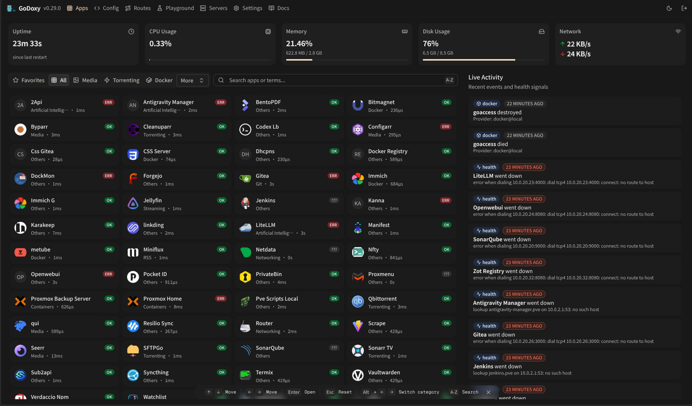

<div align="center">

# GoDoxy

[](https://sonarcloud.io/summary/new_code?id=yusing_go-proxy)

[](https://sonarcloud.io/summary/new_code?id=go-proxy)

[](https://discord.gg/umReR62nRd)

A lightweight, simple, and performant reverse proxy with WebUI.

<h5>
<a href="https://docs.godoxy.dev">Website</a> | <a href="https://docs.godoxy.dev/Home.html">Wiki</a> | <a href="https://discord.gg/umReR62nRd">Discord</a>
</h5>

<h5>EN | <a href="README_CHT.md">中文</a></h5>

Have questions? Ask [ChatGPT](https://chatgpt.com/g/g-6825390374b481919ad482f2e48936a1-godoxy-assistant)! (Thanks to [@ismesid](https://github.com/arevindh))



**New WebUI and is now available in nightly tag [(Demo)](https://nightly.demo.godoxy.dev), feedbacks are welcomed!**

</div>

## Table of content

<!-- TOC -->

- [GoDoxy](#godoxy)
  - [Table of content](#table-of-content)
  - [Running demo](#running-demo)
  - [Key Features](#key-features)
  - [Prerequisites](#prerequisites)
  - [Setup](#setup)
  - [How does GoDoxy work](#how-does-godoxy-work)
  - [Screenshots](#screenshots)
    - [idlesleeper](#idlesleeper)
    - [Metrics and Logs](#metrics-and-logs)
  - [Manual Setup](#manual-setup)
    - [Folder structrue](#folder-structrue)
  - [Build it yourself](#build-it-yourself)

## Running demo

<https://demo.godoxy.dev>

[](https://zeabur.com/referral?referralCode=yusing&utm_source=yusing&utm_campaign=oss)

## Key Features

- **Simple**
  - Effortless configuration with [simple labels](https://docs.godoxy.dev/Docker-labels-and-Route-Files) or WebUI
  - [Simple multi-node setup](https://docs.godoxy.dev/Configurations#multi-docker-nodes-setup)
  - Detailed error messages for easy troubleshooting.
- **ACL**: connection / request level access control
  - IP/CIDR
  - Country **(Maxmind account required)**
  - Timezone **(Maxmind account required)**
  - **Access logging**
- **Advanced Automation**
  - Automatic SSL certificate management with Let's Encrypt ([using DNS-01 Challenge](https://docs.godoxy.dev/DNS-01-Providers))
  - Auto-configuration for Docker containers
  - Hot-reloading of configurations and container state changes
- **Idle-sleep**: stop and wake containers based on traffic _(see [screenshots](#idlesleeper))_
  - Docker containers
  - Proxmox LXCs
- **Traffic Management**
  - HTTP reserve proxy
  - TCP/UDP port forwarding
  - **OpenID Connect support**: SSO and secure your apps easily
- **Customization**
  - [HTTP middlewares](https://docs.godoxy.dev/Middlewares)
  - [Custom error pages support](https://docs.godoxy.dev/Custom-Error-Pages)
- **Web UI**
  - App Dashboard
  - Config Editor
  - Uptime and System Metrics
  - Docker Logs Viewer
- **Cross-Platform support**
  - Supports **linux/amd64** and **linux/arm64**
- **Efficient and Performant**
  - Written in **[Go](https://go.dev)**

## Prerequisites

Configure Wildcard DNS Record(s) to point to machine running `GoDoxy`, e.g.

- A Record: `*.domain.com` -> `10.0.10.1`
- AAAA Record (if you use IPv6): `*.domain.com` -> `::ffff:a00:a01`

## Setup

> [!NOTE]
> GoDoxy is designed to be running in `host` network mode, do not change it.
>
> To change listening ports, modify `.env`.

1. Prepare a new directory for docker compose and config files.

2. Run setup script inside the directory, or [set up manually](#manual-setup)

   ```shell
   /bin/bash -c "$(curl -fsSL https://raw.githubusercontent.com/yusing/godoxy/main/scripts/setup.sh)"
   ```

3. Start the docker compose service from generated `compose.yml`:

   ```shell
   docker compose up -d
   ```

4. You may now do some extra configuration on WebUI `https://godoxy.yourdomain.com`

## How does GoDoxy work

1. List all the containers
2. Read container name, labels and port configurations for each of them
3. Create a route if applicable (a route is like a "Virtual Host" in NPM)
4. Watch for container / config changes and update automatically

> [!NOTE]
> GoDoxy uses the label `proxy.aliases` as the subdomain(s), if unset it defaults to the `container_name` field in docker compose.
>
> For example, with the label `proxy.aliases: qbt` you can access your app via `qbt.domain.com`.

## Screenshots

### idlesleeper


### Metrics and Logs

<div align="center">
  <table>
    <tr>
      <td align="center"></td>
      <td align="center"></td>
      <td align="center"></td>
    </tr>
    <tr>
      <td align="center"><b>Uptime Monitor</b></td>
      <td align="center"><b>Docker Logs</b></td>
      <td align="center"><b>Server Overview</b></td>
    </tr>
        <tr>
      <td align="center"></td>
      <td align="center"></td>
    </tr>
    <tr>
      <td align="center"><b>System Monitor</b></td>
      <td align="center"><b>Graphs</b></td>
    </tr>
  </table>
</div>

## Manual Setup

1. Make `config` directory then grab `config.example.yml` into `config/config.yml`

   `mkdir -p config && wget https://raw.githubusercontent.com/yusing/godoxy/main/config.example.yml -O config/config.yml`

2. Grab `.env.example` into `.env`

   `wget https://raw.githubusercontent.com/yusing/godoxy/main/.env.example -O .env`

3. Grab `compose.example.yml` into `compose.yml`

   `wget https://raw.githubusercontent.com/yusing/godoxy/main/compose.example.yml -O compose.yml`

### Folder structrue

```shell
├── certs
│   ├── cert.crt
│   └── priv.key
├── compose.yml
├── config
│   ├── config.yml
│   ├── middlewares
│   │   ├── middleware1.yml
│   │   ├── middleware2.yml
│   ├── provider1.yml
│   └── provider2.yml
├── data
│   ├── metrics # metrics data
│   │   ├── uptime.json
│   │   └── system_info.json
└── .env
```

## Build it yourself

1. Clone the repository `git clone https://github.com/yusing/godoxy --depth=1`

2. Install / Upgrade [go (>=1.22)](https://go.dev/doc/install) and `make` if not already

3. Clear cache if you have built this before (go < 1.22) with `go clean -cache`

4. get dependencies with `make get`

5. build binary with `make build`

[🔼Back to top](#table-of-content)
