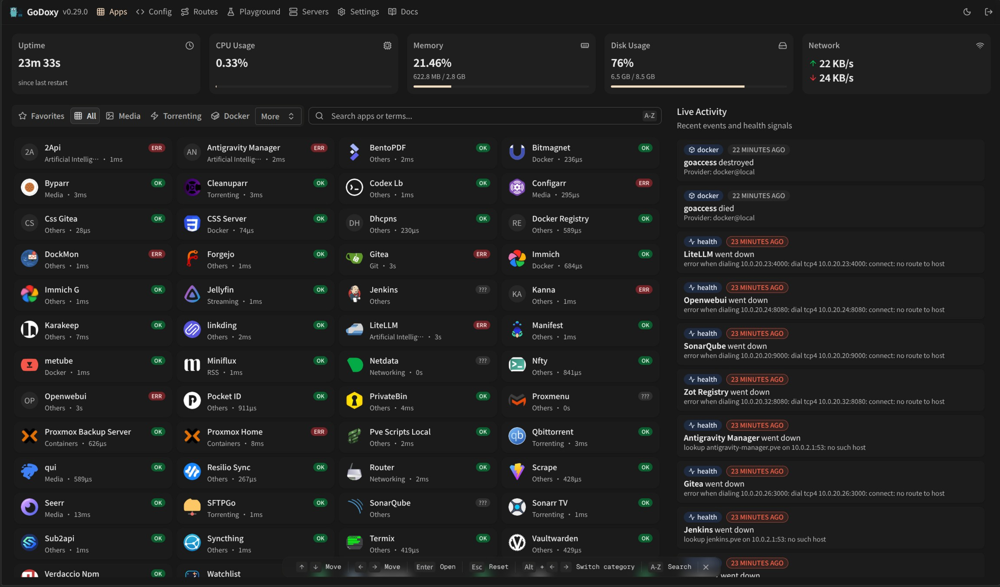

<div align="center">


[](https://sonarcloud.io/summary/new_code?id=yusing_go-proxy)

[](https://sonarcloud.io/summary/new_code?id=go-proxy)


[](https://discord.gg/umReR62nRd)

A lightweight, simple, and performant reverse proxy with WebUI.

<h5>
<a href="https://docs.godoxy.dev">Website</a> | <a href="https://docs.godoxy.dev/Home.html">Wiki</a> | <a href="https://discord.gg/umReR62nRd">Discord</a>
</h5>

<h5>EN | <a href="README_CHT.md">中文</a></h5>



Have questions? Ask [ChatGPT](https://chatgpt.com/g/g-6825390374b481919ad482f2e48936a1-godoxy-assistant)! (Thanks to [@ismesid](https://github.com/arevindh))

</div>

## Running demo

<https://demo.godoxy.dev>

## Quick start

Configure Wildcard DNS Record(s) to point to machine running `GoDoxy`, e.g.

- A Record: `*.domain.com` -> `10.0.10.1`
- AAAA Record (if you use IPv6): `*.domain.com` -> `::ffff:a00:a01`

> [!NOTE]
> GoDoxy is designed to be running in `host` network mode, do not change it.
>
> To change listening ports, modify `.env`.

1. Prepare a new directory for Docker Compose and config files.

2. Run setup script inside the directory, or [set up manually](#manual-setup)

   ```shell
   /bin/sh -c "$(curl -fsSL https://raw.githubusercontent.com/yusing/godoxy/main/scripts/setup.sh)"
   ```

3. Start the docker compose service from generated `compose.yml`:

   ```shell
   docker compose up -d
   ```

4. You may now do some extra configuration on WebUI `https://godoxy.yourdomain.com`

## Key features

- **Simple setup**
  - Configure routes with [Docker labels or route files](https://docs.godoxy.dev/Docker-labels-and-Route-Files)
  - Manage routes, config, containers, logs, metrics, and uptime from the WebUI
  - Use [multi-node Docker setups](https://docs.godoxy.dev/Configurations#multi-docker-nodes-setup)
- **Automatic routing**
  - Discover Docker and Podman containers
  - Hot-reload config and container state changes
  - Manage Let's Encrypt certificates with [DNS-01 providers](https://docs.godoxy.dev/DNS-01-Providers)
- **Traffic management**
  - HTTP reverse proxy
  - TCP/UDP port forwarding
  - OpenID Connect SSO
  - ForwardAuth integration, e.g. TinyAuth
  - [HTTP middlewares](https://docs.godoxy.dev/Middlewares)
  - [Custom error pages](https://docs.godoxy.dev/Custom-Error-Pages)
- **Access control**
  - IP/CIDR rules
  - Country and timezone rules with a MaxMind account
  - Access logging
  - Periodic access summaries
- **Idle sleep**
  - Stop and wake Docker containers based on traffic
  - Stop and wake Proxmox LXC containers based on traffic
- **Proxmox integration**
  - Bind routes automatically to nodes or LXC containers
  - Start, stop, and restart LXC containers from the WebUI
  - Stream node and LXC logs through WebSocket
- **Platform support**
  - Linux amd64
  - Linux arm64

## How GoDoxy works

1. List all the containers
2. Read container name, labels, and port configurations for each of them
3. Create a route if applicable (a route is like a "Virtual Host" in NPM)
4. Watch for container / config changes and update automatically

> [!NOTE]
> GoDoxy uses the label `proxy.aliases` as the subdomain(s), if unset it defaults to the `container_name` field in docker compose.
>
> For example, with the label `proxy.aliases: qbt` you can access your app via `qbt.domain.com`.

## Screenshots

### idlesleeper


### Metrics and Logs

<div align="center">
  <table>
    <tr>
      <td align="center"></td>
      <td align="center"></td>
    </tr>
    <tr>
      <td align="center"><b>Routes</b></td>
      <td align="center"><b>Servers</b></td>
    </tr>
  </table>
</div>

## Proxmox Integration

GoDoxy can automatically discover and manage Proxmox nodes and LXC containers through configured providers.

### Automatic Route Binding

Routes are automatically linked to Proxmox resources through reverse lookup:

1. **Node-level routes** (VMID = 0): When hostname, IP, or alias matches a Proxmox node name or IP
2. **Container-level routes** (VMID > 0): When hostname, IP, or alias matches an LXC container

This enables seamless proxy configuration without manual binding:

```yaml
routes:
  pve-node-01:
    host: pve-node-01.internal
    port: 8006
    # Automatically links to Proxmox node pve-node-01
```

### WebUI Management

From the WebUI, you can:

- **LXC Lifecycle Control**: Start, stop, restart containers
- **Node Logs**: Stream real-time journalctl or log files output from nodes
- **LXC Logs**: Stream real-time journalctl or log files output from containers

## Update / uninstall system agent

Installer supports both systemd and Alpine/OpenRC (`rc-service`) hosts.

Update:

```bash
sh -c "$(curl -fsSL https://github.com/yusing/godoxy/raw/refs/heads/main/scripts/install-agent.sh)" -- update
```

Uninstall:

```bash
sh -c "$(curl -fsSL https://github.com/yusing/godoxy/raw/refs/heads/main/scripts/install-agent.sh)" -- uninstall
```

## Manual Setup

1. Make `config` directory then grab `config.example.yml` into `config/config.yml`

   `mkdir -p config && wget https://raw.githubusercontent.com/yusing/godoxy/main/config.example.yml -O config/config.yml`

2. Grab `.env.example` into `.env`

   `wget https://raw.githubusercontent.com/yusing/godoxy/main/.env.example -O .env`

3. Grab `compose.example.yml` into `compose.yml`

   `wget https://raw.githubusercontent.com/yusing/godoxy/main/compose.example.yml -O compose.yml`

### Folder structure

```shell
├── certs
│   ├── cert.crt
│   └── priv.key
├── compose.yml
├── config
│   ├── config.yml
│   ├── middlewares
│   │   ├── middleware1.yml
│   │   ├── middleware2.yml
│   ├── provider1.yml
│   └── provider2.yml
├── data
│   ├── metrics # metrics data
│   │   ├── uptime.json
│   │   └── system_info.json
└── .env
```

## Build from source

1. Clone the repository `git clone https://github.com/yusing/godoxy --depth=1`

2. Install / Upgrade [go (>=1.22)](https://go.dev/doc/install) and [`shadowtree`](https://github.com/yusing/shadowtree) if not already

3. Clear cache if you have built this before (go < 1.22) with `go clean -cache`

4. Get dependencies with `shadowtree mod-tidy`

5. Build binary with `shadowtree build`

## Star History

[](https://www.star-history.com/#yusing/godoxy&Date)
