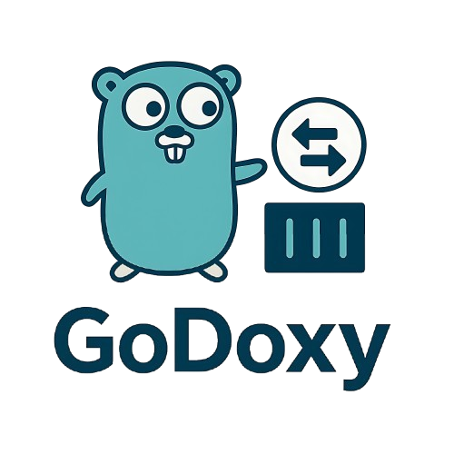
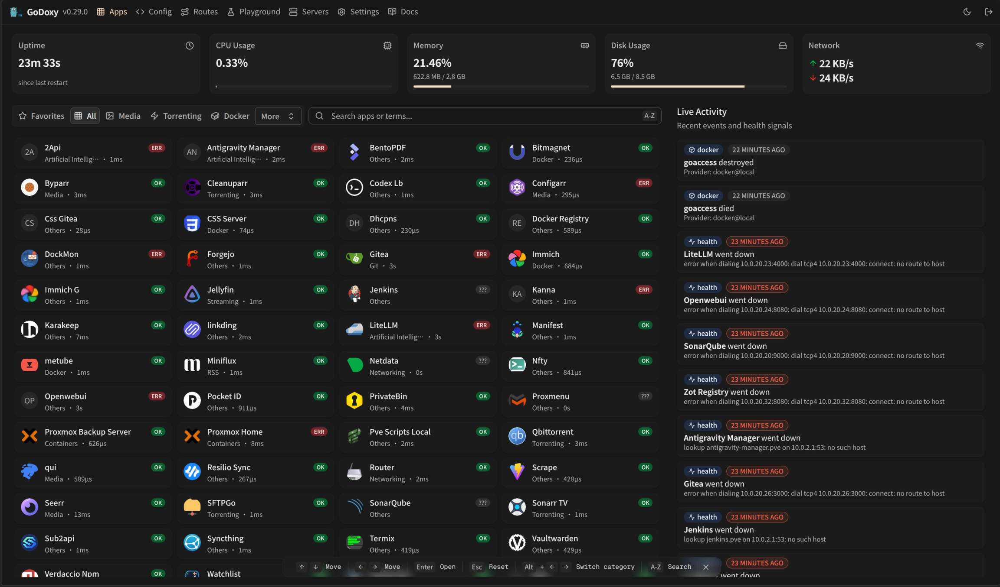
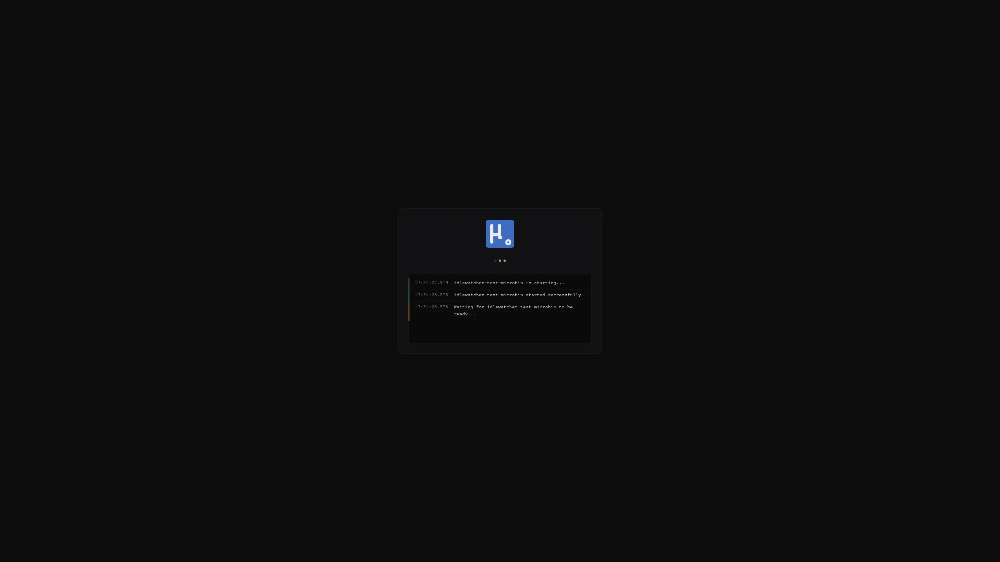
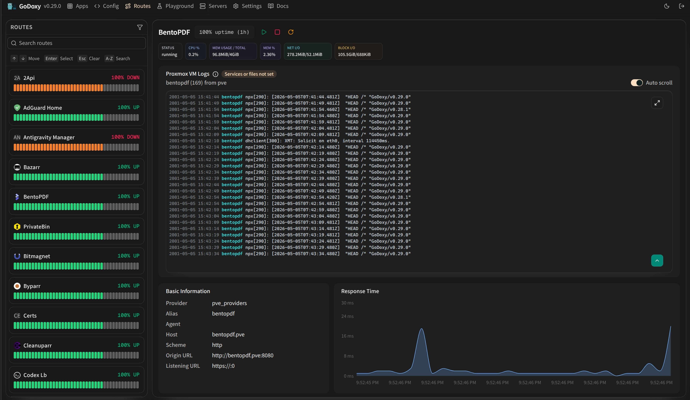
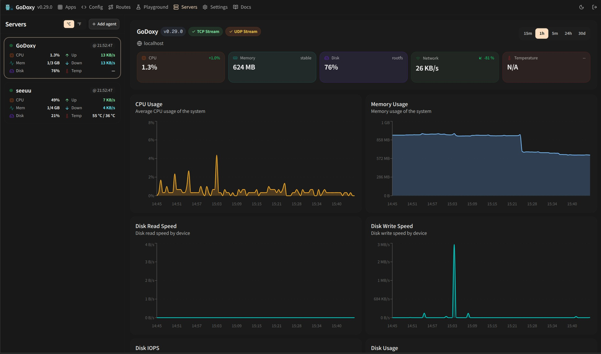

<div align="center">



[](https://sonarcloud.io/summary/new_code?id=yusing_go-proxy)

[](https://sonarcloud.io/summary/new_code?id=go-proxy)


[](https://discord.gg/umReR62nRd)

轻量、易用、高性能，且带有 WebUI 的反向代理。

<h5>
<a href="https://docs.godoxy.dev">网站</a> | <a href="https://docs.godoxy.dev/Home.html">文档</a> | <a href="https://discord.gg/umReR62nRd">Discord</a>
</h5>

<h5><a href="README.md">EN</a> | 简体中文 | <a href="README_CHT.md">繁體中文</a></h5>



有疑问？欢迎询问 [ChatGPT](https://chatgpt.com/g/g-6825390374b481919ad482f2e48936a1-godoxy-assistant)！（感谢 [@ismesid](https://github.com/arevindh)）

</div>

## 在线演示

<https://demo.godoxy.dev>

## 快速开始

配置通配符 DNS 记录，使其指向运行 `GoDoxy` 的主机，例如：

- A 记录：`*.domain.com` -> `10.0.10.1`
- AAAA 记录（如果使用 IPv6）：`*.domain.com` -> `::ffff:a00:a01`

> [!NOTE]
> GoDoxy 应在 `host` 网络模式下运行，请勿更改。
>
> 如需更改监听端口，请修改 `.env`。

1. 新建一个用于存放 Docker Compose 和配置文件的目录。

2. 在该目录中运行安装脚本，或进行[手动安装](#手动安装)

   ```shell
   /bin/sh -c "$(curl -fsSL https://raw.githubusercontent.com/yusing/godoxy/main/scripts/setup.sh)"
   ```

3. 使用生成的 `compose.yml` 启动 Docker Compose 服务：

   ```shell
   docker compose up -d
   ```

4. 现在可以通过 WebUI `https://godoxy.yourdomain.com` 进行其他配置

## 主要功能

- **简单部署**
  - 使用 [Docker 标签或路由文件](https://docs.godoxy.dev/Docker-labels-and-Route-Files)配置路由
  - 通过 WebUI 管理路由、配置、容器、日志、指标和运行时间
  - 支持[多节点 Docker 配置](https://docs.godoxy.dev/Configurations#multi-docker-nodes-setup)
- **自动路由**
  - 自动发现 Docker 和 Podman 容器
  - 在配置或容器状态发生变化时热重载
  - 通过 [DNS-01 提供商](https://docs.godoxy.dev/DNS-01-Providers)管理 Let's Encrypt 证书
- **流量管理**
  - HTTP 反向代理
  - TCP/UDP 端口转发
  - OpenID Connect SSO
  - ForwardAuth 集成，例如 TinyAuth
  - [HTTP 中间件](https://docs.godoxy.dev/Middlewares)
  - [自定义错误页面](https://docs.godoxy.dev/Custom-Error-Pages)
- **访问控制**
  - IP/CIDR 规则
  - 基于国家/地区和时区的规则（需要 MaxMind 账户）
  - 访问日志
  - 定期生成访问摘要
- **空闲休眠**
  - 根据流量停止和唤醒 Docker 容器
  - 根据流量停止和唤醒 Proxmox LXC 容器
- **Proxmox 集成**
  - 自动将路由绑定到节点或 LXC 容器
  - 通过 WebUI 启动、停止和重启 LXC 容器
  - 通过 WebSocket 实时传输节点和 LXC 日志
- **平台支持**
  - Linux amd64
  - Linux arm64

## GoDoxy 的工作原理

1. 列出所有容器
2. 读取每个容器的名称、标签和端口配置
3. 在适用时创建路由（类似于 NPM 中的“Virtual Host”）
4. 监控容器和配置变化并自动更新

> [!NOTE]
> GoDoxy 使用 `proxy.aliases` 标签作为子域名；如果未设置，则默认使用 Docker Compose 中的 `container_name` 字段。
>
> 例如，设置标签 `proxy.aliases: qbt` 后，可以通过 `qbt.domain.com` 访问应用。

## 截图

### 空闲休眠



### 指标与日志

<div align="center">
  <table>
    <tr>
      <td align="center"></td>
      <td align="center"></td>
    </tr>
    <tr>
      <td align="center"><b>路由</b></td>
      <td align="center"><b>服务器</b></td>
    </tr>
  </table>
</div>

## Proxmox 集成

GoDoxy 可以通过已配置的提供商自动发现和管理 Proxmox 节点及 LXC 容器。

### 自动绑定路由

路由会通过反向查询自动关联到 Proxmox 资源：

1. **节点级路由** (VMID = 0)：主机名、IP 或别名与 Proxmox 节点名称或 IP 匹配时
2. **容器级路由** (VMID > 0)：主机名、IP 或别名与 LXC 容器匹配时

这样无需手动绑定即可完成代理配置：

```yaml
routes:
  pve-node-01:
    host: pve-node-01.internal
    port: 8006
    # 自动关联到 Proxmox 节点 pve-node-01
```

### WebUI 管理

可以通过 WebUI：

- **LXC 生命周期管理**：启动、停止和重启容器
- **节点日志**：实时传输节点的 journalctl 或日志文件输出
- **LXC 日志**：实时传输容器的 journalctl 或日志文件输出

## 更新 / 卸载系统代理 (System Agent)

安装脚本同时支持 systemd 和 Alpine/OpenRC（`rc-service`）主机。

更新：

```bash
sh -c "$(curl -fsSL https://github.com/yusing/godoxy/raw/refs/heads/main/scripts/install-agent.sh)" -- update
```

卸载：

```bash
sh -c "$(curl -fsSL https://github.com/yusing/godoxy/raw/refs/heads/main/scripts/install-agent.sh)" -- uninstall
```

## 手动安装

1. 创建 `config` 目录，然后将 `config.example.yml` 下载到 `config/config.yml`

   `mkdir -p config && wget https://raw.githubusercontent.com/yusing/godoxy/main/config.example.yml -O config/config.yml`

2. 将 `.env.example` 下载到 `.env`

   `wget https://raw.githubusercontent.com/yusing/godoxy/main/.env.example -O .env`

3. 将 `compose.example.yml` 下载到 `compose.yml`

   `wget https://raw.githubusercontent.com/yusing/godoxy/main/compose.example.yml -O compose.yml`

### 目录结构

```shell
├── certs
│   ├── cert.crt
│   └── priv.key
├── compose.yml
├── config
│   ├── config.yml
│   ├── middlewares
│   │   ├── middleware1.yml
│   │   ├── middleware2.yml
│   ├── provider1.yml
│   └── provider2.yml
├── data
│   ├── metrics # 指标数据
│   │   ├── uptime.json
│   │   └── system_info.json
└── .env
```

## 从源码构建

1. 克隆仓库：`git clone https://github.com/yusing/godoxy --depth=1`

2. 如果尚未安装，请安装或升级 [Go (>=1.22)](https://go.dev/doc/install) 和 [`shadowtree`](https://github.com/yusing/shadowtree)

3. 如果之前使用 Go 1.22 以下版本构建过，请运行 `go clean -cache` 清除缓存

4. 使用 `shadowtree mod-tidy` 获取依赖项

5. 使用 `shadowtree build` 构建二进制文件

## Star History

[](https://star-history.dera.page/#yusing/godoxy&Date)
