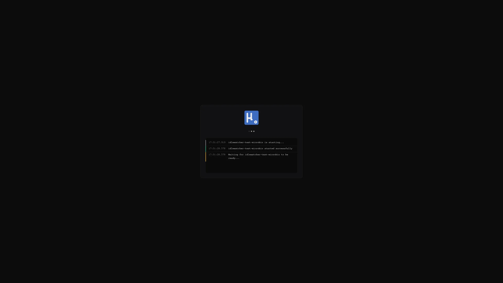
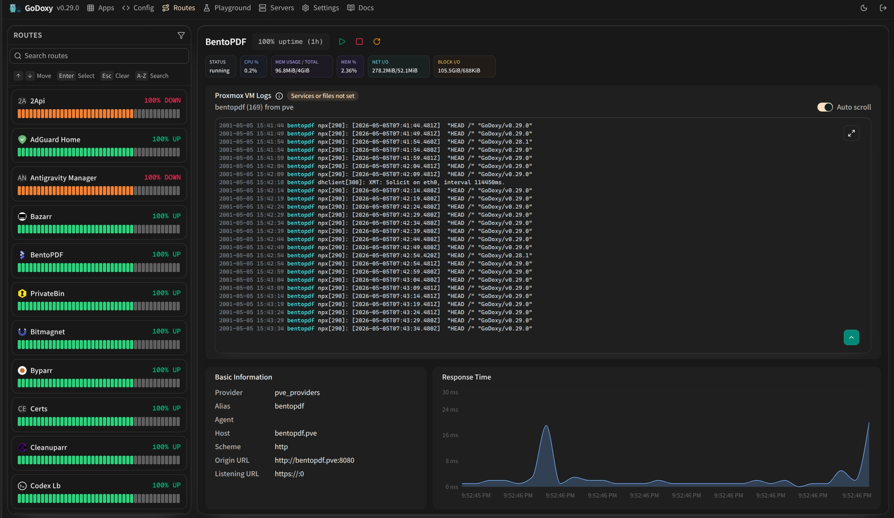
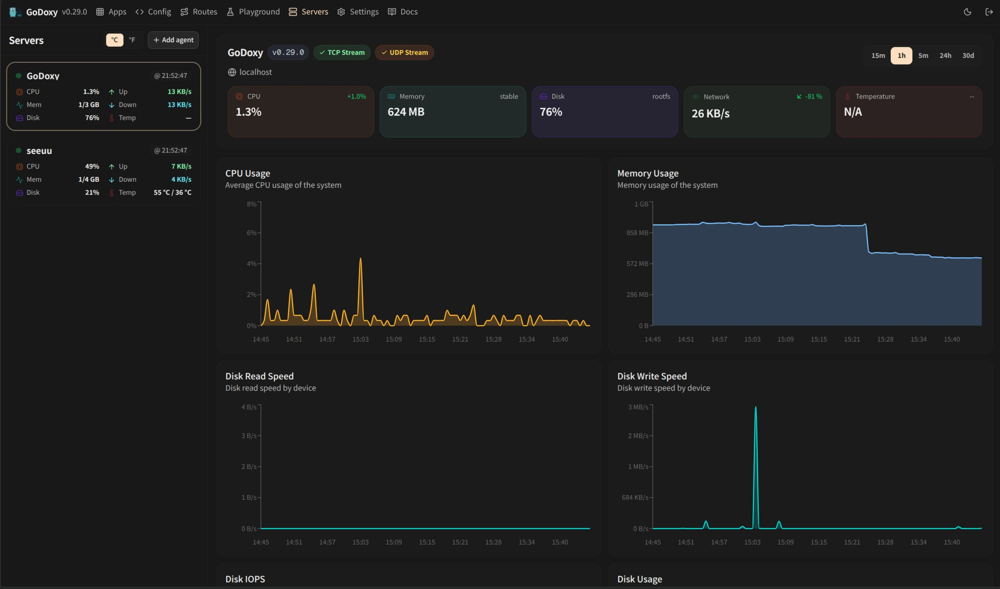

<div align="center">


[](https://sonarcloud.io/summary/new_code?id=yusing_go-proxy)

[](https://sonarcloud.io/summary/new_code?id=yusing_go-proxy)


[](https://discord.gg/umReR62nRd)

輕量、易用、 高效能，且帶有主頁和配置面板的反向代理

<h5>
<a href="https://docs.godoxy.dev">網站</a> | <a href="https://docs.godoxy.dev/Home.html">文檔</a> | <a href="https://discord.gg/umReR62nRd">Discord</a>
</h5>

<h5><a href="README.md">EN</a> | 中文</h5>


有疑問? 問 [ChatGPT](https://chatgpt.com/g/g-6825390374b481919ad482f2e48936a1-godoxy-assistant)！（鳴謝 [@ismesid](https://github.com/arevindh)）

</div>

## 目錄

<!-- TOC -->

- [目錄](#目錄)
- [運行示例](#運行示例)
- [主要特點](#主要特點)
- [前置需求](#前置需求)
- [安裝](#安裝)
  - [手動安裝](#手動安裝)
  - [資料夾結構](#資料夾結構)
- [Proxmox 整合](#proxmox-整合)
  - [自動路由綁定](#自動路由綁定)
  - [WebUI 管理](#webui-管理)
- [更新 / 卸載系統代理 (System Agent)](#更新--卸載系統代理-system-agent)
- [截圖](#截圖)
  - [閒置休眠](#閒置休眠)
  - [監控](#監控)
- [自行編譯](#自行編譯)
- [Star History](#star-history)

## 運行示例

<https://demo.godoxy.dev>

## 主要特點

- **簡單易用**
  - 透過 Docker[標籤](https://docs.godoxy.dev/Docker-labels-and-Route-Files)或 WebUI 輕鬆設定
  - [簡單的多節點設置](https://docs.godoxy.dev/Configurations#multi-docker-nodes-setup)
  - 詳細的錯誤訊息，便於故障排除
- **存取控制 (ACL)**：連線/請求層級存取控制
  - IP/CIDR
  - 國家 **(需要 Maxmind 帳戶)**
  - 時區 **(需要 Maxmind 帳戶)**
  - **存取日誌記錄**
  - 定時發送摘要 (允許和拒絕的連線次數)
- **自動化**
  - 使用 Let's Encrypt 自動管理 SSL 憑證 ([使用 DNS-01 驗證](https://docs.godoxy.dev/DNS-01-Providers))
  - Docker 容器自動配置
  - 設定檔與容器狀態變更時自動熱重載
- **容器運行時支援**
  - Docker
  - Podman
- **閒置休眠**：根據流量停止和喚醒容器 _(參見[截圖](#閒置休眠))_
  - Docker 容器
  - Proxmox LXC 容器
- **Proxmox 整合**
  - **自動路由綁定**：透過比對主機名稱、IP 或別名自動將路由綁定至 Proxmox 節點或 LXC 容器
  - **LXC 生命週期控制**：可直接從 WebUI 啟動、停止、重新啟動容器
  - **即時日誌**：透過 WebSocket 串流節點和 LXC 容器的 journalctl 日誌
- **流量管理**
  - HTTP 反向代理
  - TCP/UDP 連接埠轉送
  - **OpenID Connect 支援**：輕鬆實現單點登入 (SSO) 並保護您的應用程式
  - **ForwardAuth 支援**：整合任何 auth provider (例如 TinyAuth)
- **客製化**
  - [HTTP 中介軟體](https://docs.godoxy.dev/Middlewares)
  - [支援自訂錯誤頁面](https://docs.godoxy.dev/Custom-Error-Pages)
- **網頁使用者介面 (Web UI)**
  - 應用程式一覽
  - 設定編輯器
  - 執行時間與系統指標
  - **Docker**
    - 容器生命週期管理 (啟動、停止、重新啟動)
    - 透過 WebSocket 即時串流容器日誌
  - **Proxmox**
    - LXC 容器生命週期管理 (啟動、停止、重新啟動)
    - 透過 WebSocket 即時串流節點和 LXC 容器 journalctl 日誌
- **跨平台支援**
  - 支援 **linux/amd64** 與 **linux/arm64**
- **高效能**
  - 以 **[Go](https://go.dev)** 語言編寫

## 前置需求

設置 DNS 記錄指向運行 `GoDoxy` 的機器，例如：

- A 記錄：`*.y.z` -> `10.0.10.1`
- AAAA 記錄：`*.y.z` -> `::ffff:a00:a01`

## 安裝

> [!NOTE]
> GoDoxy 僅在 `host` 網路模式下運作，請勿更改。
>
> 如需更改監聽埠，請修改 `.env`。

1. 準備一個新目錄用於 docker compose 和配置文件。

2. 在目錄內運行安裝腳本，或[手動安裝](#手動安裝)

   ```shell
   /bin/bash -c "$(curl -fsSL https://raw.githubusercontent.com/yusing/godoxy/main/scripts/setup.sh)"
   ```

3. 現在可以在 WebUI `https://godoxy.yourdomain.com` 進行額外配置

### 手動安裝

1. 建立 `config` 目錄，然後將 `config.example.yml` 下載到 `config/config.yml`

   `mkdir -p config && wget https://raw.githubusercontent.com/yusing/godoxy/main/config.example.yml -O config/config.yml`

2. 將 `.env.example` 下載到 `.env`

   `wget https://raw.githubusercontent.com/yusing/godoxy/main/.env.example -O .env`

3. 將 `compose.example.yml` 下載到 `compose.yml`

   `wget https://raw.githubusercontent.com/yusing/godoxy/main/compose.example.yml -O compose.yml`

### 資料夾結構

```shell
├── certs
│   ├── cert.crt
│   └── priv.key
├── compose.yml
├── config
│   ├── config.yml
│   ├── middlewares
│   │   ├── middleware1.yml
│   │   ├── middleware2.yml
│   ├── provider1.yml
│   └── provider2.yml
├── data
│   ├── metrics # metrics data
│   │   ├── uptime.json
│   │   └── system_info.json
└── .env
```

## Proxmox 整合

GoDoxy 可透過配置的提供者自動探索和管理 Proxmox 節點和 LXC 容器。

### 自動路由綁定

路由透過反向查詢自動連結至 Proxmox 資源：

1. **節點級路由** (VMID = 0)：當主機名稱、IP 或別名符合 Proxmox 節點名稱或 IP 時
2. **容器級路由** (VMID > 0)：當主機名稱、IP 或別名符合 LXC 容器時

這可實現無需手動綁定的無縫代理配置：

```yaml
routes:
  pve-node-01:
    host: pve-node-01.internal
    port: 8006
    # 自動連結至 Proxmox 節點 pve-node-01
```

### WebUI 管理

您可以從 WebUI：

- **LXC 生命週期控制**：啟動、停止、重新啟動容器
- **節點日誌**：串流節點的即時 journalctl 或日誌檔案輸出
- **LXC 日誌**：串流容器的即時 journalctl 或日誌檔案輸出

## 更新 / 卸載系統代理 (System Agent)

安裝腳本同時支援 systemd 與 Alpine/OpenRC（`rc-service`）主機。

更新：

```bash
sudo /bin/sh -c "$(curl -fsSL https://github.com/yusing/godoxy/raw/refs/heads/main/scripts/install-agent.sh)" -- update
```

卸載：

```bash
sudo /bin/sh -c "$(curl -fsSL https://github.com/yusing/godoxy/raw/refs/heads/main/scripts/install-agent.sh)" -- uninstall
```

## 截圖

### 閒置休眠



### 監控

<div align="center">
  <table>
    <tr>
      <td align="center"></td>
      <td align="center"></td>
    </tr>
    <tr>
      <td align="center"><b>路由</b></td>
      <td align="center"><b>伺服器</b></td>
    </tr>
  </table>
</div>

## 自行編譯

1. 克隆儲存庫 `git clone https://github.com/yusing/godoxy --depth=1`

2. 如果尚未安裝，請安裝/升級 [go (>=1.22)](https://go.dev/doc/install) 和 `make`

3. 如果之前編譯過（go < 1.22），請使用 `go clean -cache` 清除快取

4. 使用 `make get` 獲取依賴

5. 使用 `make build` 編譯二進制檔案

## Star History

[](https://www.star-history.com/#yusing/godoxy&Date)

[🔼 回到頂部](#目錄)
