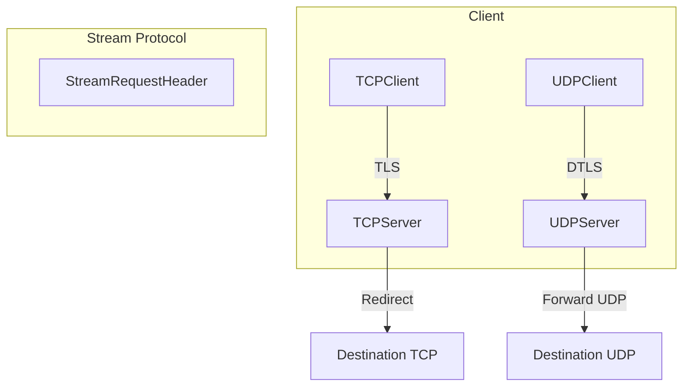

# Stream proxy protocol

This package implements a small header-based handshake that allows an authenticated client to request forwarding to a `(host, port)` destination. It supports both TCP-over-TLS and UDP-over-DTLS transports.

## Overview



## Header

The on-wire header is a fixed-size binary blob:

- `Version` (8 bytes)
- `HostLength` (1 byte)
- `Host` (255 bytes, NUL padded)
- `PortLength` (1 byte)
- `Port` (5 bytes, NUL padded)
- `Checksum` (4 bytes, big-endian CRC32)

Total: `headerSize = 8 + 1 + 255 + 1 + 5 + 4 = 274` bytes.

Checksum is `crc32.ChecksumIEEE(header[0:headerSize-4])`.

See [`StreamRequestHeader`](header.go:25).

## File Structure

| File                                | Purpose                                                      |
| ----------------------------------- | ------------------------------------------------------------ |
| [`header.go`](header.go)            | Stream request header structure and validation.              |
| [`tcp_client.go`](tcp_client.go:12) | TCP client implementation with TLS transport.                |
| [`tcp_server.go`](tcp_server.go:13) | TCP server implementation for handling stream requests.      |
| [`udp_client.go`](udp_client.go:13) | UDP client implementation with DTLS transport.               |
| [`udp_server.go`](udp_server.go:17) | UDP server implementation for handling DTLS stream requests. |
| [`common.go`](common.go:11)         | Connection manager and shared constants.                     |

## Constants

| Constant       | Value                     | Purpose                                           |
| -------------- | ------------------------- | ------------------------------------------------- |
| `StreamALPN`   | `"godoxy-agent-stream/1"` | TLS ALPN protocol for stream multiplexing.        |
| `headerSize`   | `274` bytes               | Total size of the stream request header.          |
| `dialTimeout`  | `10s`                     | Timeout for establishing destination connections. |
| `readDeadline` | `10s`                     | Read timeout for UDP destination sockets.         |

See [`common.go`](common.go:11).

## Public API

### Types

#### `StreamRequestHeader`

Represents the on-wire protocol header used to negotiate a stream tunnel.

```go
type StreamRequestHeader struct {
    Version     [8]byte  // Fixed to "0.1.0" with NUL padding
    HostLength  byte     // Actual host name length (0-255)
    Host        [255]byte // NUL-padded host name
    PortLength  byte     // Actual port string length (0-5)
    Port        [5]byte  // NUL-padded port string
    Checksum    [4]byte  // CRC32 checksum of header without checksum
}
```

**Methods:**

- `NewStreamRequestHeader(host, port string) (*StreamRequestHeader, error)` - Creates a header for the given host and port. Returns error if host exceeds 255 bytes or port exceeds 5 bytes.
- `Validate() bool` - Validates the version and checksum.
- `GetHostPort() (string, string)` - Extracts the host and port from the header.

### TCP Functions

- [`NewTCPClient()`](tcp_client.go:26) - Creates a TLS client connection and sends the stream header.
- [`NewTCPServerHandler()`](tcp_server.go:24) - Creates a handler for ALPN-multiplexed connections (no listener).
- [`NewTCPServerFromListener()`](tcp_server.go:36) - Wraps an existing TLS listener.
- [`NewTCPServer()`](tcp_server.go:45) - Creates a fully-configured TCP server with TLS listener.

### UDP Functions

- [`NewUDPClient()`](udp_client.go:27) - Creates a DTLS client connection and sends the stream header.
- [`NewUDPServer()`](udp_server.go:26) - Creates a DTLS server listening on the given UDP address.

## TCP behavior

1. Client establishes a TLS connection to the stream server.
2. Client sends exactly one header as a handshake.
3. After the handshake, both sides proxy raw TCP bytes between client and destination.

Server reads the header using `io.ReadFull` to avoid dropping bytes.

See [`NewTCPClient()`](tcp_client.go:26) and [`(*TCPServer).redirect()`](tcp_server.go:116).

## UDP-over-DTLS behavior

1. Client establishes a DTLS connection to the stream server.
2. Client sends exactly one header as a handshake.
3. After the handshake, both sides proxy raw UDP datagrams:
   - client -> destination: DTLS payload is written to destination `UDPConn`
   - destination -> client: destination payload is written back to the DTLS connection

Responses do **not** include a header.

The UDP server uses a bidirectional forwarding model:

- One goroutine forwards from client to destination
- Another goroutine forwards from destination to client

The destination reader uses `readDeadline` to periodically wake up and check for context cancellation. Timeouts do not terminate the session.

See [`NewUDPClient()`](udp_client.go:27) and [`(*UDPServer).handleDTLSConnection()`](udp_server.go:89).

## Connection Management

Both `TCPServer` and `UDPServer` create a dedicated destination connection per incoming stream session and close it when the session ends (no destination connection reuse).

## Error Handling

| Error              | Description                                     |
| ------------------ | ----------------------------------------------- |
| `ErrInvalidHeader` | Header validation failed (version or checksum). |

Errors from connection creation are propagated to the caller.

See [`header.go`](header.go:23).

## Integration

This package is used by the agent to provide stream tunneling capabilities. See the parent [`agent`](../README.md) package for integration details with the GoDoxy server.

### Certificate Requirements

Both TCP and UDP servers require:

- CA certificate for client verification
- Server certificate for TLS/DTLS termination

Both clients require:

- CA certificate for server verification
- Client certificate for mTLS authentication

### ALPN Protocol

The `StreamALPN` constant (`"godoxy-agent-stream/1"`) is used to multiplex stream tunnel traffic and HTTPS API traffic on the same port. Connections negotiating this ALPN are routed to the stream handler.
