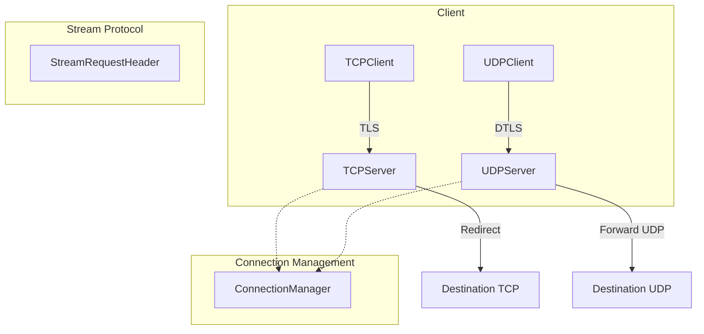

# Stream proxy protocol

This package implements a small header-based handshake that allows an authenticated client to request forwarding to a `(host, port)` destination. It supports both TCP-over-TLS and UDP-over-DTLS transports.

## Overview



## Header

The on-wire header is a fixed-size binary blob:

- `Version` (8 bytes)
- `HostLength` (1 byte)
- `Host` (255 bytes, NUL padded)
- `PortLength` (1 byte)
- `Port` (5 bytes, NUL padded)
- `Checksum` (4 bytes, big-endian CRC32)

Total: `headerSize = 8 + 1 + 255 + 1 + 5 + 4 = 273` bytes.

Checksum is `crc32.ChecksumIEEE(header[0:headerSize-4])`.

See [`StreamRequestHeader`](header.go:25).

## File Structure

| File                                | Purpose                                                      |
| ----------------------------------- | ------------------------------------------------------------ |
| [`header.go`](header.go)            | Stream request header structure and validation.              |
| [`tcp_client.go`](tcp_client.go:26) | TCP client implementation with TLS transport.                |
| [`tcp_server.go`](tcp_server.go:45) | TCP server implementation for handling stream requests.      |
| [`udp_client.go`](udp_client.go:27) | UDP client implementation with DTLS transport.               |
| [`udp_server.go`](udp_server.go:26) | UDP server implementation for handling DTLS stream requests. |
| [`common.go`](common.go:31)         | Connection manager and shared constants.                     |

## Constants

| Constant       | Value                     | Purpose                                           |
| -------------- | ------------------------- | ------------------------------------------------- |
| `StreamALPN`   | `"godoxy-agent-stream/1"` | TLS ALPN protocol for stream multiplexing.        |
| `headerSize`   | `273` bytes               | Total size of the stream request header.          |
| `dialTimeout`  | `10s`                     | Timeout for establishing destination connections. |
| `readDeadline` | `10s`                     | Read timeout for UDP destination sockets.         |

See [`common.go`](common.go:11).

## TCP behavior

1. Client establishes a TLS connection to the stream server.
2. Client sends exactly one header as a handshake.
3. After the handshake, both sides proxy raw TCP bytes between client and destination.

Server reads the header using `io.ReadFull` to avoid dropping bytes.

See [`NewTCPClient()`](tcp_client.go:26) and [`(*TCPServer).redirect()`](tcp_server.go:116).

### TCP Server variants

- [`NewTCPServer()`](tcp_server.go:45) - Creates a fully-configured TCP server with TLS listener.
- [`NewTCPServerFromListener()`](tcp_server.go:36) - Wraps an existing TLS listener.
- [`NewTCPServerHandler()`](tcp_server.go:24) - Handler for ALPN-multiplexed connections.

## UDP-over-DTLS behavior

1. Client establishes a DTLS connection to the stream server.
2. Client sends exactly one header as a handshake.
3. After the handshake, both sides proxy raw UDP datagrams:
   - client → destination: DTLS payload is written to destination `UDPConn`
   - destination → client: destination payload is written back to the DTLS connection

Responses do **not** include a header.

See [`NewUDPClient()`](udp_client.go:27) and [`(*UDPServer).handleDTLSConnection()`](udp_server.go:89).

## Connection Management

The [`ConnectionManager`](common.go:26) handles destination connection pooling:

- Each client connection gets a unique destination connection.
- Connections are created on-demand and cached by client remote address.
- Connections are closed when the client disconnects.

```go
// Get or create a destination connection for the given host:port
conn, err := connMgr.GetOrCreateDestConnection(clientConn, host, port)

// Clean up when client disconnects
connMgr.DeleteDestConnection(clientConn)
```

## Error Handling

| Error              | Description                                     |
| ------------------ | ----------------------------------------------- |
| `ErrInvalidHeader` | Header validation failed (version or checksum). |

See [`header.go`](header.go:23).

## Integration

This package is used by the agent to provide stream tunneling capabilities. See the parent [`agent`](../README.md) package for integration details with the GoDoxy server.

### Certificate Requirements

Both TCP and UDP servers require:

- CA certificate for client verification
- Server certificate for TLS/DTLS termination

Both clients require:

- CA certificate for server verification
- Client certificate for mTLS authentication
