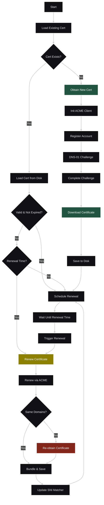
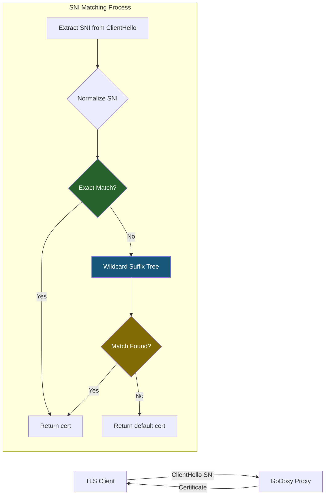
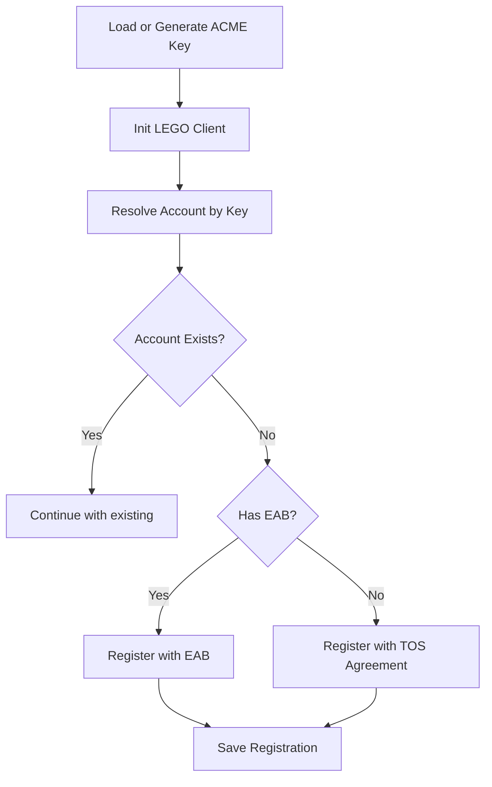
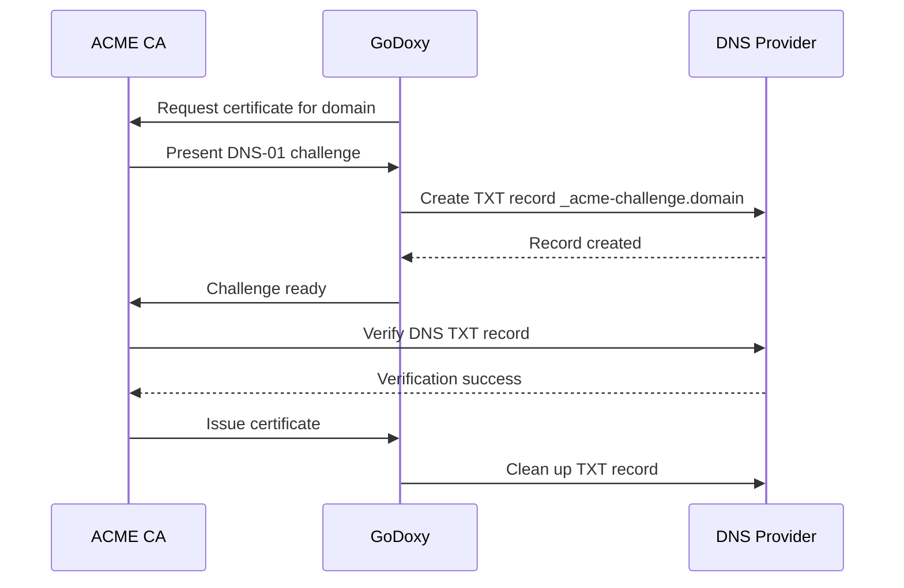
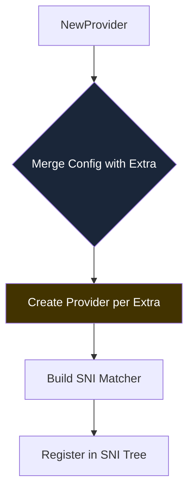
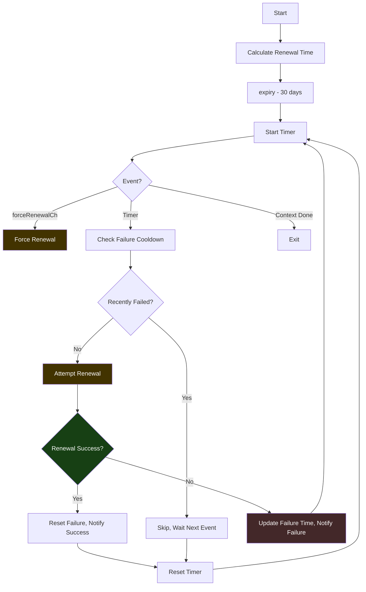
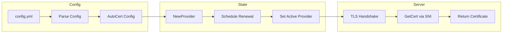

# Autocert Package

Automated SSL certificate management using the ACME protocol (Let's Encrypt and compatible CAs).

## Architecture Overview

```
┌────────────────────────────────────────────────────────────────────────────┐
│                              GoDoxy Proxy                                  │
├────────────────────────────────────────────────────────────────────────────┤
│  ┌──────────────────────┐     ┌─────────────────────────────────────────┐  │
│  │   Config.State       │────▶│  autocert.Provider                      │  │
│  │  (config loading)    │     │  ┌───────────────────────────────────┐  │  │
│  └──────────────────────┘     │  │  main Provider                    │  │  │
│                               │  │  - Primary certificate            │  │  │
│                               │  │  - SNI matcher                    │  │  │
│                               │  │  - Renewal scheduler              │  │  │
│                               │  └───────────────────────────────────┘  │  │
│                               │  ┌───────────────────────────────────┐  │  │
│                               │  │  extraProviders[]                 │  │  │
│                               │  │  - Additional certifictes         │  │  │
│                               │  │  - Different domains/A            │  │  │
│                               │  └───────────────────────────────────┘  │  │
│                               └─────────────────────────────────────────┘  │
│                                       │                                    │
│                                       ▼                                    │
│                         ┌────────────────────────────────┐                 │
│                         │      TLS Handshake             │                 │
│                         │  GetCert(ClientHelloInf)       │                 │
│                         └────────────────────────────────┘                 │
└────────────────────────────────────────────────────────────────────────────┘
```

## Certificate Lifecycle



## SNI Matching Flow

When a TLS client connects with Server Name Indication (SNI), the proxy needs to select the correct certificate.



### Suffix Tree Structure

The `sniMatcher` uses an optimized suffix tree for efficient wildcard matching:

```
Certificate: *.example.com, example.com, *.api.example.com

exact:
  "example.com" → Provider_A

root:
  └── "com"
      └── "example"
          ├── "*" → Provider_A  [wildcard at *.example.com]
          └── "api"
              └── "*" → Provider_B  [wildcard at *.api.example.com]
```

## Key Components

### Config

Configuration for certificate management, loaded from `config/autocert.yml`.

```go
type Config struct {
    Email       string                       // ACME account email
    Domains     []string                     // Domains to certifiy
    CertPath    string                       // Output cert path
    KeyPath     string                       // Output key path
    Extra       []ConfigExtra                // Additional cert configs
    ACMEKeyPath string                       // ACME account private key (shared by all extras)
    Provider    string                       // DNS provider name
    Options     map[string]strutils.Redacted // Provider-specific options
    Resolvers   []string                     // DNS resolvers for DNS-01
    CADirURL    string                       // Custom ACME CA directory
    CACerts     []string                     // Custom CA certificates
    EABKid      string                       // External Account Binding Key ID
    EABHmac     string                       // External Account Binding HMAC

    idx int // 0: main, 1+: extra[i]
}

type ConfigExtra Config
```

**Extra Provider Merging:** Extra configurations are merged with the main config using `MergeExtraConfig()`, inheriting most settings from the main provider while allowing per-certificate overrides for `Provider`, `Email`, `Domains`, `Options`, `Resolvers`, `CADirURL`, `CACerts`, `EABKid`, `EABHmac`, and `HTTPClient`. The `ACMEKeyPath` is shared across all providers.

**Validation:**

- Extra configs must have unique `cert_path` and `key_path` values (no duplicates across main or any extra provider)

### ConfigExtra

Extra certificate configuration type. Uses `MergeExtraConfig()` to inherit settings from the main provider:

```go
func MergeExtraConfig(mainCfg *Config, extraCfg *ConfigExtra) ConfigExtra
```

Fields that can be overridden per extra provider:

- `Provider` - DNS provider name
- `Email` - ACME account email
- `Domains` - Certificate domains
- `Options` - Provider-specific options
- `Resolvers` - DNS resolvers
- `CADirURL` - Custom ACME CA directory
- `CACerts` - Custom CA certificates
- `EABKid` / `EABHmac` - External Account Binding credentials
- `HTTPClient` - Custom HTTP client

Fields inherited from main config (shared):

- `ACMEKeyPath` - ACME account private key (same for all)

**Provider Types:**

- `local` - No ACME, use existing certificate (default)
- `pseudo` - Mock provider for testing
- `custom` - Custom ACME CA with `CADirURL`

### Provider

Main certificate management struct that handles:

- Certificate issuance and renewal
- Loading certificates from disk
- SNI-based certificate selection
- Renewal scheduling

```go
type Provider struct {
    logger                 zerolog.Logger    // Provider-scoped logger

    cfg                    *Config           // Configuration
    user                   *User             // ACME account
    legoCfg                *lego.Config      // LEGO client config
    client                 *lego.Client      // ACME client
    lastFailure            time.Time         // Last renewal failure
    legoCert               *certificate.Resource // Cached cert resource
    tlsCert                *tls.Certificate  // Parsed TLS certificate
    certExpiries           CertExpiries      // Domain → expiry map
    extraProviders         []*Provider       // Additional certificates
    sniMatcher             sniMatcher         // SNI → Provider mapping
    forceRenewalCh         chan struct{}     // Force renewal trigger channel
    scheduleRenewalOnce    sync.Once         // Prevents duplicate renewal scheduling
}
```

**Logging:** Each provider has a scoped logger with provider name ("main" or "extra[N]") for consistent log context.

**Key Methods:**

- `NewProvider(cfg *Config, user *User, legoCfg *lego.Config) (*Provider, error)` - Creates provider and initializes extra providers atomically
- `GetCert(hello *tls.ClientHelloInfo)` - Returns certificate for TLS handshake
- `GetName()` - Returns provider name ("main" or "extra[N]")
- `ObtainCert()` - Obtains new certificate via ACME
- `ObtainCertAll()` - Renews/obtains certificates for main and all extra providers
- `ObtainCertIfNotExistsAll()` - Obtains certificates only if they don't exist on disk
- `ForceExpiryAll()` - Triggers forced certificate renewal for main and all extra providers
- `ScheduleRenewalAll(parent task.Parent)` - Schedules automatic renewal for all providers
- `PrintCertExpiriesAll()` - Logs certificate expiry dates for all providers

### User

ACME account representation implementing lego's `acme.User` interface.

```go
type User struct {
    Email        string                    // Account email
    Registration *registration.Resource    // ACME registration
    Key          crypto.PrivateKey         // Account key
}
```

### sniMatcher

Efficient SNI-to-Provider lookup with exact and wildcard matching.

```go
type sniMatcher struct {
    exact map[string]*Provider      // Exact domain matches
    root  sniTreeNode               // Wildcard suffix tree
}

type sniTreeNode struct {
    children map[string]*sniTreeNode  // DNS label → child node
    wildcard *Provider                // Wildcard match at this level
}
```

## DNS Providers

Supported DNS providers for DNS-01 challenge validation:

| Provider     | Name           | Description                              |
| ------------ | -------------- | ---------------------------------------- |
| Cloudflare   | `cloudflare`   | Cloudflare DNS                           |
| Route 53     | `route53`      | AWS Route 53                             |
| DigitalOcean | `digitalocean` | DigitalOcean DNS                         |
| GoDaddy      | `godaddy`      | GoDaddy DNS                              |
| OVH          | `ovh`          | OVHcloud DNS                             |
| CloudDNS     | `clouddns`     | Google Cloud DNS                         |
| AzureDNS     | `azuredns`     | Azure DNS                                |
| DuckDNS      | `duckdns`      | DuckDNS                                  |
| and more...  |                | See `internal/dnsproviders/providers.go` |

### Provider Configuration

Each provider accepts configuration via the `options` map:

```yaml
autocert:
  provider: cloudflare
  email: admin@example.com
  domains:
    - example.com
    - '*.example.com'
  options:
    CF_API_TOKEN: your-api-token
    CF_ZONE_API_TOKEN: your-zone-token
  resolvers:
    - 1.1.1.1:53
```

## ACME Integration

### Account Registration



### DNS-01 Challenge



## Multi-Certificate Support

The package supports multiple certificates through the `extra` configuration:

```yaml
autocert:
  provider: cloudflare
  email: admin@example.com
  domains:
    - example.com
    - '*.example.com'
  cert_path: certs/example.com.crt
  key_path: certs/example.com.key
  extra:
    - domains:
        - api.example.com
        - '*.api.example.com'
      cert_path: certs/api.example.com.crt
      key_path: certs/api.example.com.key
      provider: cloudflare
      email: admin@api.example.com
```

### Extra Provider Setup

Extra providers are initialized atomically within `NewProvider()`:



## Renewal Scheduling

### Renewal Timing

- **Initial Check**: Certificate expiry is checked at startup
- **Renewal Window**: Renewal scheduled for 1 month before expiry
- **Cooldown on Failure**: 1-hour cooldown after failed renewal
- **Request Cooldown**: 15-second cooldown after startup (prevents rate limiting)
- **Force Renewal**: `forceRenewalCh` channel allows triggering immediate renewal

### Force Renewal

The `forceRenewalCh` channel (buffered size 1) enables immediate certificate renewal on demand:

```go
// Trigger forced renewal for main and all extra providers
provider.ForceExpiryAll()
```



**Notifications:** Renewal success/failure triggers system notifications with provider name.

### CertState

Certificate state tracking:

```go
const (
    CertStateValid    // Certificate is valid and up-to-date
    CertStateExpired  // Certificate has expired or needs renewal
    CertStateMismatch // Certificate domains don't match config
)
```

### RenewMode

Controls renewal behavior:

```go
const (
    renewModeForce    // Force renewal, bypass cooldown and state check
    renewModeIfNeeded // Renew only if expired or domain mismatch
)
```

## File Structure

```
internal/autocert/
├── README.md              # This file
├── config.go              # Config struct and validation
├── provider.go            # Provider implementation
├── setup.go               # Extra provider setup
├── sni_matcher.go         # SNI matching logic
├── providers.go           # DNS provider registration
├── state.go               # Certificate state enum
├── user.go                # ACME user/account
├── paths.go               # Default paths
└── types/
    └── provider.go        # Provider interface
```

## Default Paths

| Constant             | Default Value    | Description              |
| -------------------- | ---------------- | ------------------------ |
| `CertFileDefault`    | `certs/cert.crt` | Default certificate path |
| `KeyFileDefault`     | `certs/priv.key` | Default private key path |
| `ACMEKeyFileDefault` | `certs/acme.key` | Default ACME account key |

Failure tracking file is generated per-certificate: `<cert_dir>/.last_failure-<hash>`

## Error Handling

The package uses structured error handling with `gperr`:

- **ErrMissingField** - Required configuration field missing
- **ErrDuplicatedPath** - Duplicate certificate/key paths in extras
- **ErrInvalidDomain** - Invalid domain format
- **ErrUnknownProvider** - Unknown DNS provider
- **ErrGetCertFailure** - Certificate retrieval failed

**Error Context:** All errors are prefixed with provider name ("main" or "extra[N]") via `fmtError()` for clear attribution.

### Failure Tracking

Last failure is persisted per-certificate to prevent rate limiting:

```go
// File: <cert_dir>/.last_failure-<hash> where hash is SHA256(certPath|keyPath)[:6]
```

**Cooldown Checks:** Last failure is checked in `obtainCertIfNotExists()` (15-second startup cooldown) and `renew()` (1-hour failure cooldown). The `renewModeForce` bypasses cooldown checks entirely.

## Integration with GoDoxy

The autocert package integrates with GoDoxy's configuration system:



### REST API

Force certificate renewal via WebSocket endpoint:

| Endpoint             | Method | Description                               |
| -------------------- | ------ | ----------------------------------------- |
| `/api/v1/cert/renew` | GET    | Triggers `ForceExpiryAll()` via WebSocket |

The endpoint streams live logs during the renewal process.

## Usage Example

```yaml
# config/config.yml
autocert:
  provider: cloudflare
  email: admin@example.com
  domains:
    - example.com
    - '*.example.com'
  options:
    CF_API_TOKEN: ${CF_API_TOKEN}
  resolvers:
    - 1.1.1.1:53
    - 8.8.8.8:53
```

```go
// In config initialization
autocertCfg := state.AutoCert
user, legoCfg, err := autocertCfg.GetLegoConfig()
if err != nil {
    return err
}

provider, err := autocert.NewProvider(autocertCfg, user, legoCfg)
if err != nil {
    return fmt.Errorf("autocert error: %w", err)
}

if err := provider.ObtainCertIfNotExistsAll(); err != nil {
    return fmt.Errorf("failed to obtain certificates: %w", err)
}

provider.ScheduleRenewalAll(state.Task())
provider.PrintCertExpiriesAll()
```
