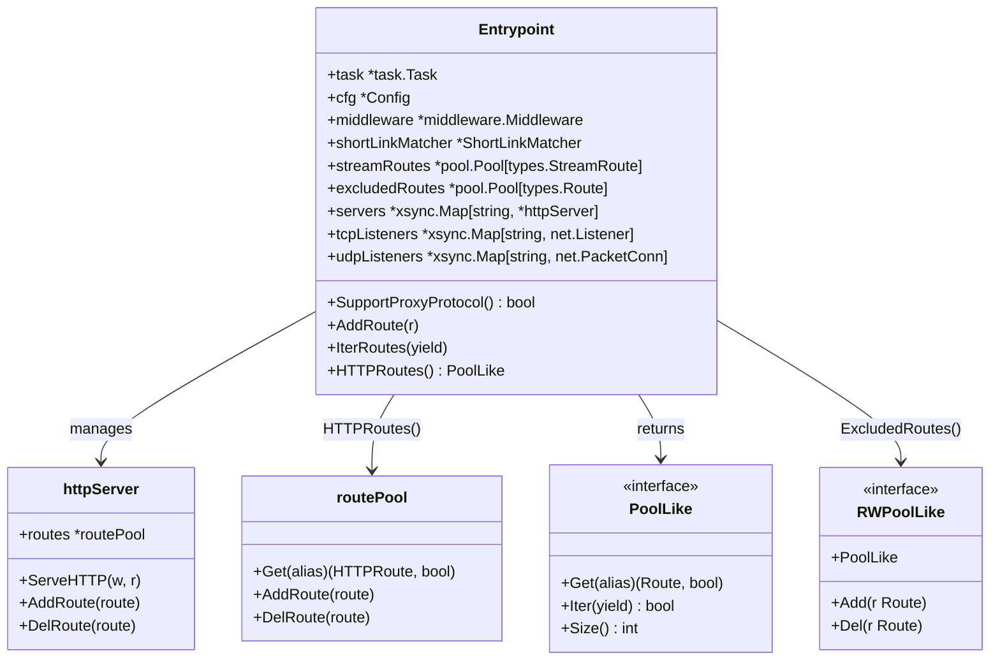
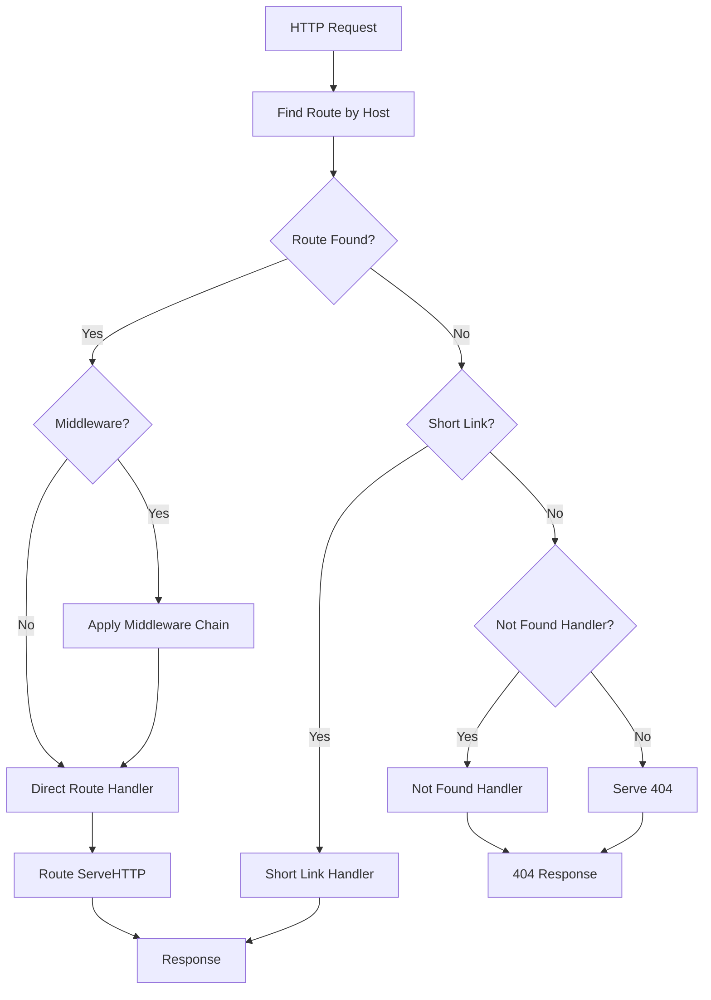
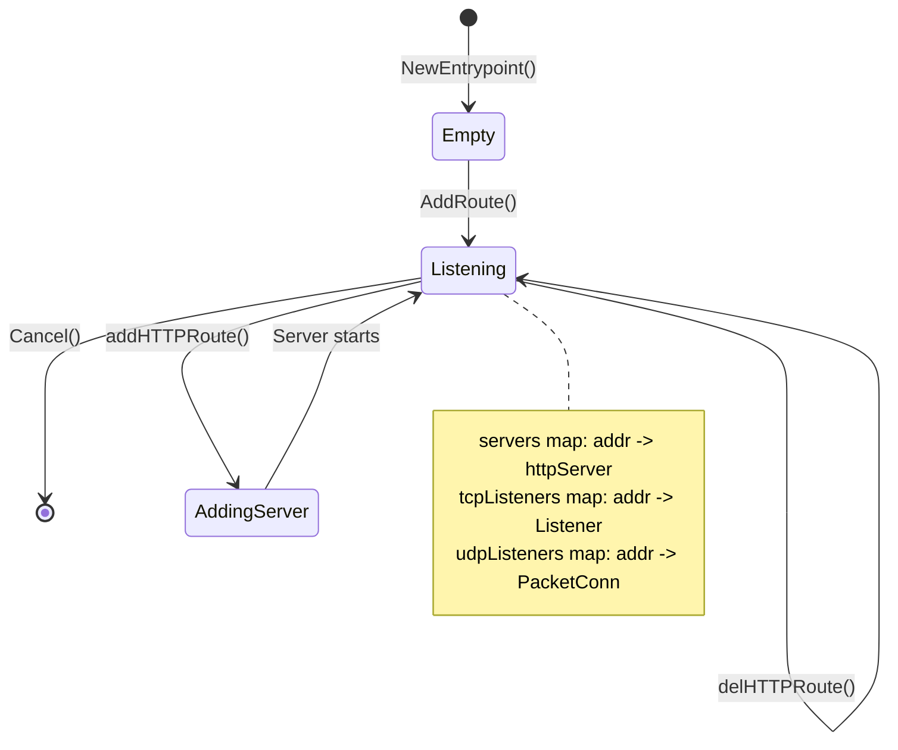
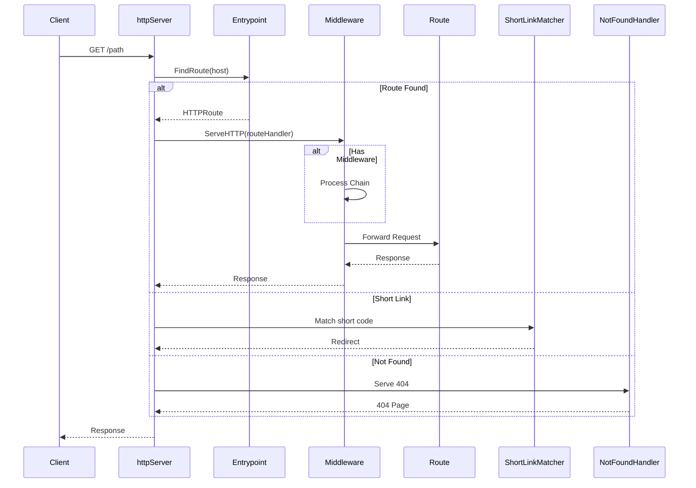

# Entrypoint

The entrypoint package provides the main HTTP entry point for GoDoxy, handling domain-based routing, middleware application, short link matching, access logging, and HTTP/TCP/UDP server lifecycle management.

## Overview

The entrypoint package implements the primary HTTP handler that receives all incoming requests, manages the lifecycle of HTTP/TCP/UDP servers, determines the target route based on hostname, applies middleware, and forwards requests to the appropriate route handler.

### Key Features

- Domain-based route lookup with subdomain support
- Short link (`go/<alias>` domain) handling
- Middleware chain application
- Access logging for all requests
- Configurable not-found handling
- Per-domain route resolution
- Multi-protocol server management (HTTP/HTTPS/TCP/UDP)
- Route pool abstractions via [`PoolLike`](internal/entrypoint/types/entrypoint.go:27) and [`RWPoolLike`](internal/entrypoint/types/entrypoint.go:33) interfaces

### Primary Consumers

- **HTTP servers**: Per-listen-addr servers dispatch requests to routes
- **Route providers**: Register routes via [`AddRoute`](internal/entrypoint/routes.go:48)
- **Configuration layer**: Validates and applies middleware/access-logging config

### Non-goals

- Does not implement route discovery (delegates to providers)
- Does not handle TLS certificate management (delegates to autocert)
- Does not implement health checks (delegates to `internal/health/monitor`)

### Stability

Internal package with stable core interfaces. The [`Entrypoint`](internal/entrypoint/types/entrypoint.go:7) interface is the public contract.

## Public API

### Entrypoint Interface

```go
type Entrypoint interface {
    // Server capabilities
    SupportProxyProtocol() bool
    DisablePoolsLog(v bool)

    // Route registry access
    GetRoute(alias string) (types.Route, bool)
    AddRoute(r types.Route)
    IterRoutes(yield func(r types.Route) bool)
    NumRoutes() int
    RoutesByProvider() map[string][]types.Route

    // Route pool accessors
    HTTPRoutes() PoolLike[types.HTTPRoute]
    StreamRoutes() PoolLike[types.StreamRoute]
    ExcludedRoutes() RWPoolLike[types.Route]

    // Health info queries
    GetHealthInfo() map[string]types.HealthInfo
    GetHealthInfoWithoutDetail() map[string]types.HealthInfoWithoutDetail
    GetHealthInfoSimple() map[string]types.HealthStatus
}
```

### Pool Interfaces

```go
type PoolLike[Route types.Route] interface {
    Get(alias string) (Route, bool)
    Iter(yield func(alias string, r Route) bool)
    Size() int
}

type RWPoolLike[Route types.Route] interface {
    PoolLike[Route]
    Add(r Route)
    Del(r Route)
}
```

### Configuration

```go
type Config struct {
    SupportProxyProtocol bool `json:"support_proxy_protocol"`
}
```

## Architecture

### Core Components



### Request Processing Pipeline



### Server Lifecycle



## Data Flow



## Route Registry

Routes are now managed per-entrypoint instead of global registry:

```go
// Adding a route
ep.AddRoute(route)

// Iterating all routes
ep.IterRoutes(func(r types.Route) bool {
    log.Info().Str("alias", r.Name()).Msg("route")
    return true // continue iteration
})

// Querying by alias
route, ok := ep.GetRoute("myapp")

// Grouping by provider
byProvider := ep.RoutesByProvider()
```

## Configuration Surface

### Config Source

Environment variables and YAML config file:

```yaml
entrypoint:
  support_proxy_protocol: true
```

### Environment Variables

| Variable                       | Description                   |
| ------------------------------ | ----------------------------- |
| `PROXY_SUPPORT_PROXY_PROTOCOL` | Enable PROXY protocol support |

## Dependency and Integration Map

| Dependency                       | Purpose                    |
| -------------------------------- | -------------------------- |
| `internal/route`                 | Route types and handlers   |
| `internal/route/rules`           | Not-found rules processing |
| `internal/logging/accesslog`     | Request logging            |
| `internal/net/gphttp/middleware` | Middleware chain           |
| `internal/types`                 | Route and health types     |
| `github.com/puzpuzpuz/xsync/v4`  | Concurrent server map      |
| `github.com/yusing/goutils/pool` | Route pool implementations |
| `github.com/yusing/goutils/task` | Lifecycle management       |

## Observability

### Logs

| Level   | Context               | Description             |
| ------- | --------------------- | ----------------------- |
| `DEBUG` | `route`, `listen_url` | Route addition/removal  |
| `DEBUG` | `addr`, `proto`       | Server lifecycle        |
| `ERROR` | `route`, `listen_url` | Server startup failures |

### Metrics

Route metrics exposed via [`GetHealthInfo`](internal/entrypoint/query.go:10) methods:

```go
// Health info for all routes
healthMap := ep.GetHealthInfo()
// {
//   "myapp": {Status: "healthy", Uptime: 3600, Latency: 5ms},
//   "excluded-route": {Status: "unknown", Detail: "n/a"},
// }
```

## Security Considerations

- Route lookup is read-only from route pools
- Middleware chain is applied per-request
- Proxy protocol support must be explicitly enabled
- Access logger captures request metadata before processing

## Failure Modes and Recovery

| Failure               | Behavior                       | Recovery                     |
| --------------------- | ------------------------------ | ---------------------------- |
| Server bind fails     | Error logged, route not added  | Fix port/address conflict    |
| Route start fails     | Route excluded, error logged   | Fix route configuration      |
| Middleware load fails | AddRoute returns error         | Fix middleware configuration |
| Context cancelled     | All servers stopped gracefully | Restart entrypoint           |

## Usage Examples

### Basic Setup

```go
ep := entrypoint.NewEntrypoint(parent, &entrypoint.Config{
    SupportProxyProtocol: false,
})

// Configure domain matching
ep.SetFindRouteDomains([]string{".example.com", "example.com"})

// Configure middleware
err := ep.SetMiddlewares([]map[string]any{
    {"rate_limit": map[string]any{"requests_per_second": 100}},
})
if err != nil {
    return err
}

// Configure access logging
err = ep.SetAccessLogger(parent, &accesslog.RequestLoggerConfig{
    Path: "/var/log/godoxy/access.log",
})
if err != nil {
    return err
}
```

### Route Querying

```go
// Iterate all routes including excluded
for r := range ep.IterRoutes {
    log.Info().
        Str("alias", r.Name()).
        Str("provider", r.ProviderName()).
        Bool("excluded", r.ShouldExclude()).
        Msg("route")
}

// Get health info for all routes
healthMap := ep.GetHealthInfoSimple()
for alias, status := range healthMap {
    log.Info().Str("alias", alias).Str("status", string(status)).Msg("health")
}
```

### Route Addition

```go
route := &route.Route{
    Alias:  "myapp",
    Scheme: route.SchemeHTTP,
    Host:   "myapp",
    Port:   route.Port{Proxy: 80, Target: 3000},
}

ep.AddRoute(route)
```

## Context Integration

Routes can access the entrypoint from request context:

```go
// Set entrypoint in context
entrypoint.SetCtx(r.Context(), ep)

// Get entrypoint from context
if ep := entrypoint.FromCtx(r.Context()); ep != nil {
    route, ok := ep.GetRoute("alias")
}
```

## Testing Notes

- Benchmark tests in [`entrypoint_benchmark_test.go`](internal/entrypoint/entrypoint_benchmark_test.go)
- Integration tests in [`entrypoint_test.go`](internal/entrypoint/entrypoint_test.go)
- Mock route pools for unit testing
- Short link tests in [`shortlink_test.go`](internal/entrypoint/shortlink_test.go)
