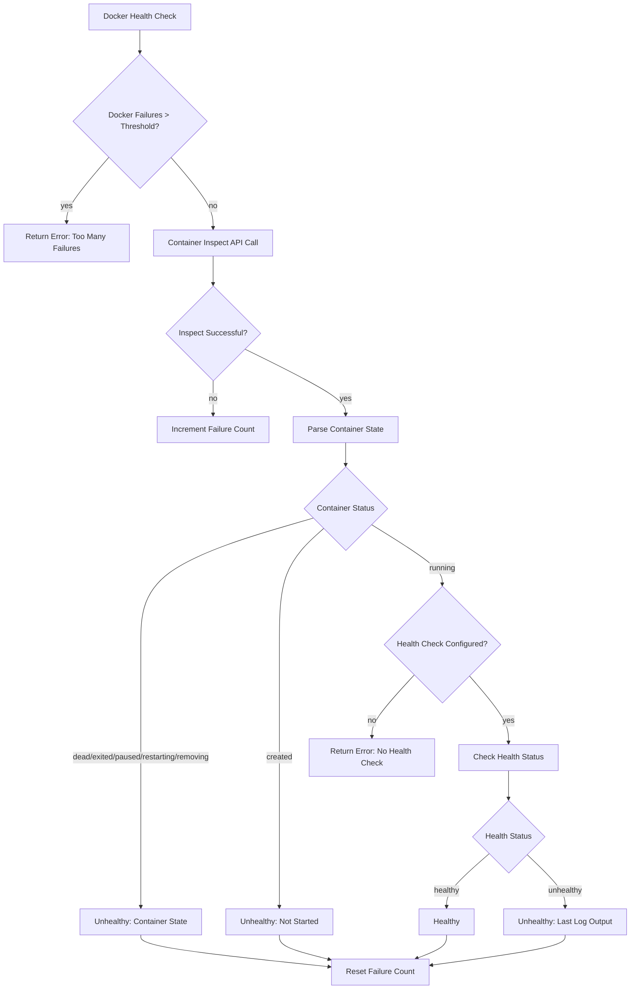
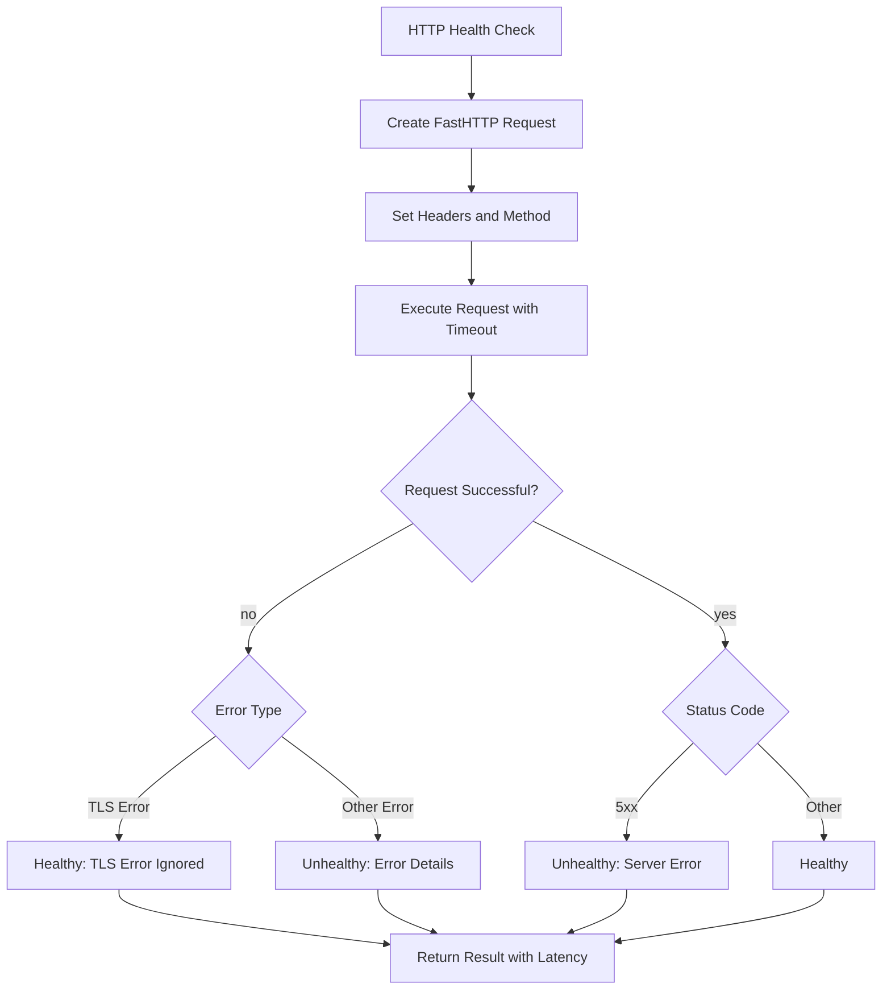
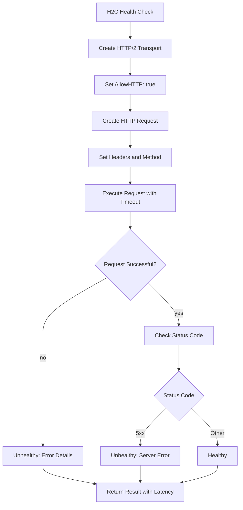
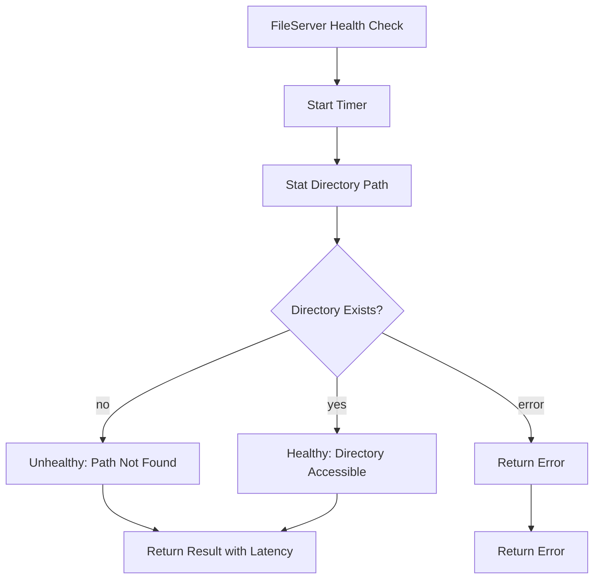
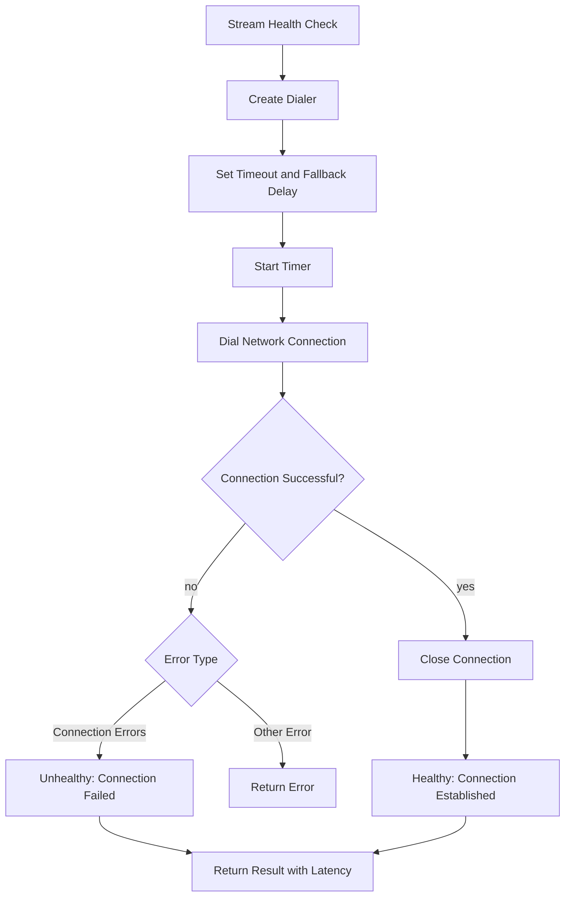

# Health Check

This package provides low-level health check implementations for different protocols and services in GoDoxy.

## Health Check Types

### Docker Health Check

Checks the health status of Docker containers using the Docker API.

**Flow:**

**Key Features:**

- Intercepts Docker API responses to extract container state
- Tracks failure count with configurable threshold (3 failures)
- Supports containers with and without health check configurations
- Returns detailed error information from Docker health check logs

### HTTP Health Check

Performs HTTP/HTTPS health checks using fasthttp for optimal performance.

**Flow:**

**Key Features:**

- Uses fasthttp for high-performance HTTP requests
- Supports both GET and HEAD methods
- Configurable timeout and path
- Handles TLS certificate verification errors gracefully
- Returns latency measurements

### H2C Health Check

Performs HTTP/2 cleartext (h2c) health checks for services that support HTTP/2 without TLS.

**Flow:**

**Key Features:**

- Uses HTTP/2 transport with cleartext support
- Supports both GET and HEAD methods
- Configurable timeout and path
- Returns latency measurements

### FileServer Health Check

Checks if a file server root directory exists and is accessible.

**Flow:**

**Key Features:**

- Simple directory existence check
- Measures latency of filesystem operation
- Distinguishes between "not found" and other errors
- Returns detailed error information

### Stream Health Check

Checks stream endpoint connectivity by attempting to establish a network connection.

**Flow:**

**Key Features:**

- Generic network connection check
- Supports any stream protocol (TCP, UDP, etc.)
- Handles common connection errors gracefully
- Measures connection establishment latency
- Automatically closes connections

## Common Features

### Error Handling

All health checks implement consistent error handling:

- **Temporary Errors**: Network timeouts, connection failures
- **Permanent Errors**: Invalid configurations, missing resources
- **Graceful Degradation**: Returns health status even when errors occur

### Performance Monitoring

- **Latency Measurement**: All checks measure execution time
- **Timeout Support**: Configurable timeouts prevent hanging
- **Resource Cleanup**: Proper cleanup of connections and resources

### Integration

These health checks are used by the monitor package to implement route-specific health monitoring:

- HTTP/HTTPS routes use HTTP health checks
- File server routes use FileServer health checks
- Stream routes use Stream health checks
- Docker containers use Docker health checks with fallbacks
