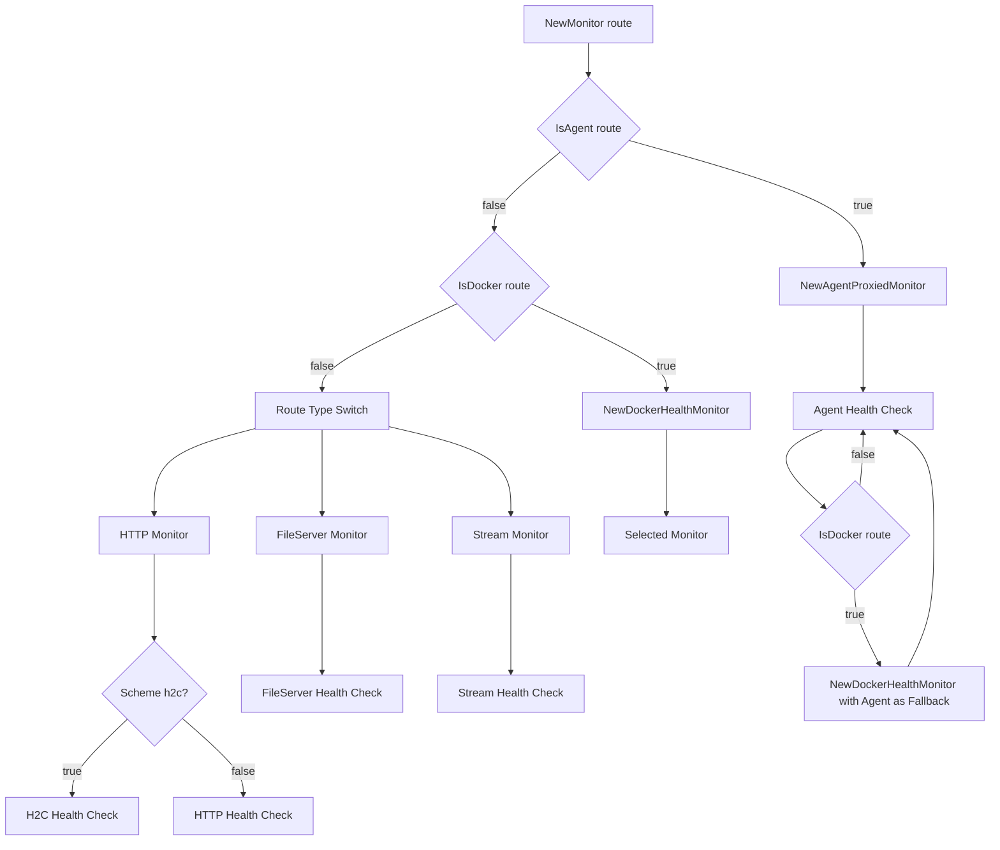

# Health Monitor

This package provides health monitoring functionality for different types of routes in GoDoxy.

## Health Check Flow

```mermaid
flowchart TD
    A[NewMonitor route] --> B{IsAgent route}
    B -->|true| C[NewAgentProxiedMonitor]
    B -->|false| D{IsDocker route}
    D -->|true| E[NewDockerHealthMonitor]
    D -->|false| F[Route Type Switch]

    F --> G[HTTP Monitor]
    F --> H[FileServer Monitor]
    F --> I[Stream Monitor]

    E --> J[Selected Monitor]

    C --> K[Agent Health Check]
    G --> L{Scheme h2c?}
    L -->|true| M[H2C Health Check]
    L -->|false| N[HTTP Health Check]
    H --> O[FileServer Health Check]
    I --> P[Stream Health Check]

    K --> Q{IsDocker route}
    Q -->|true| R[NewDockerHealthMonitor with Agent as Fallback]
    Q -->|false| K

    R --> K
```
