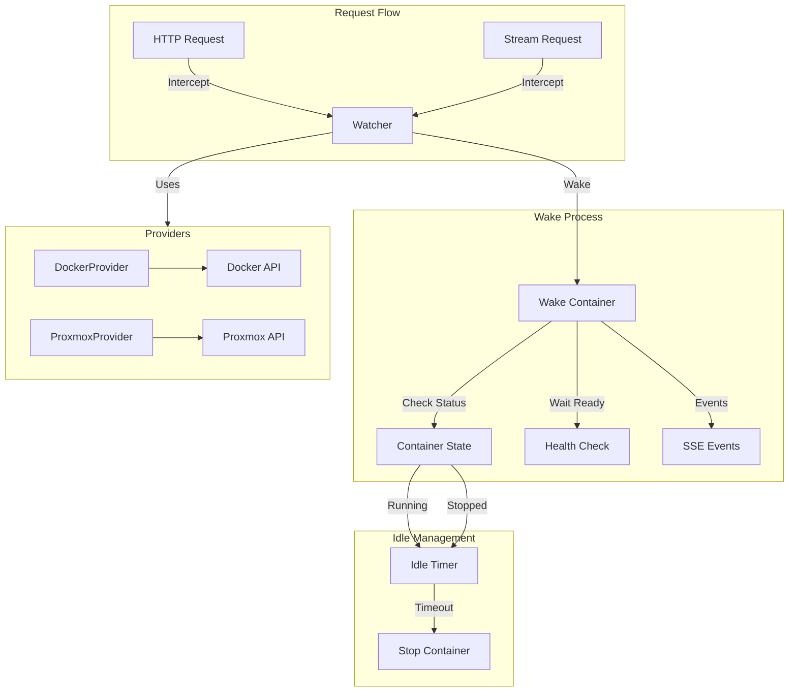
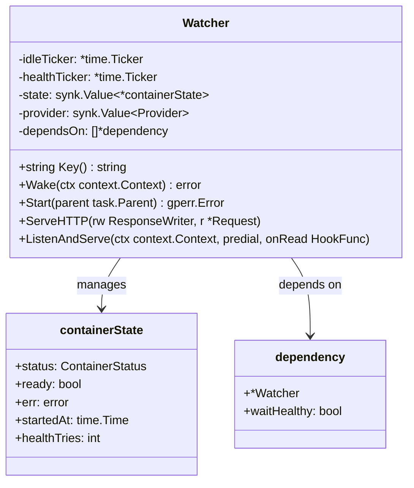
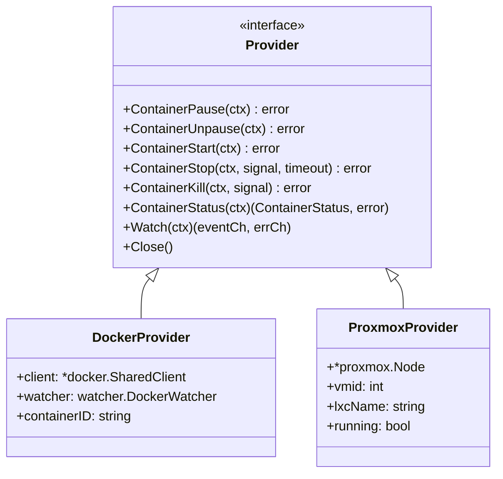
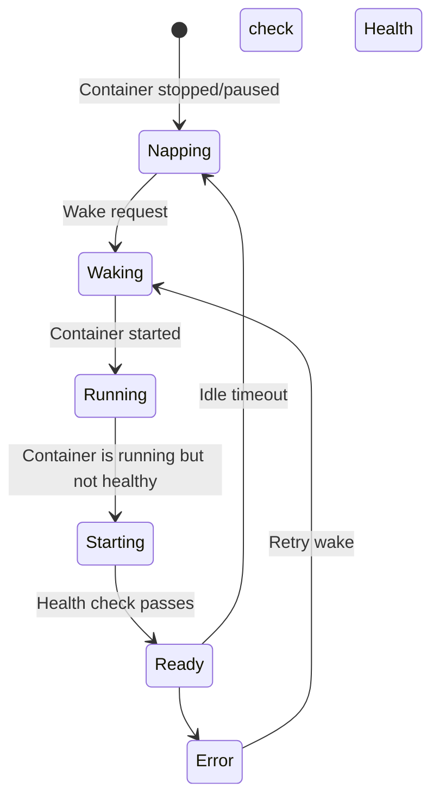
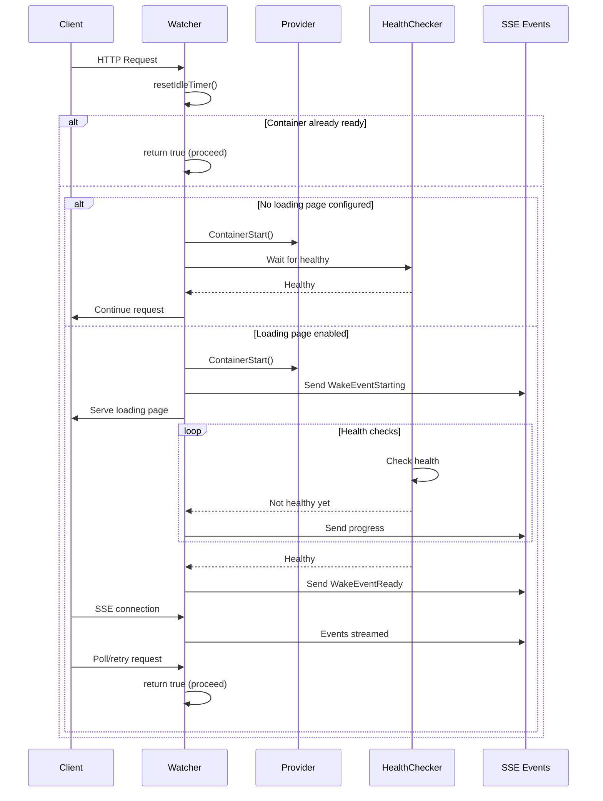
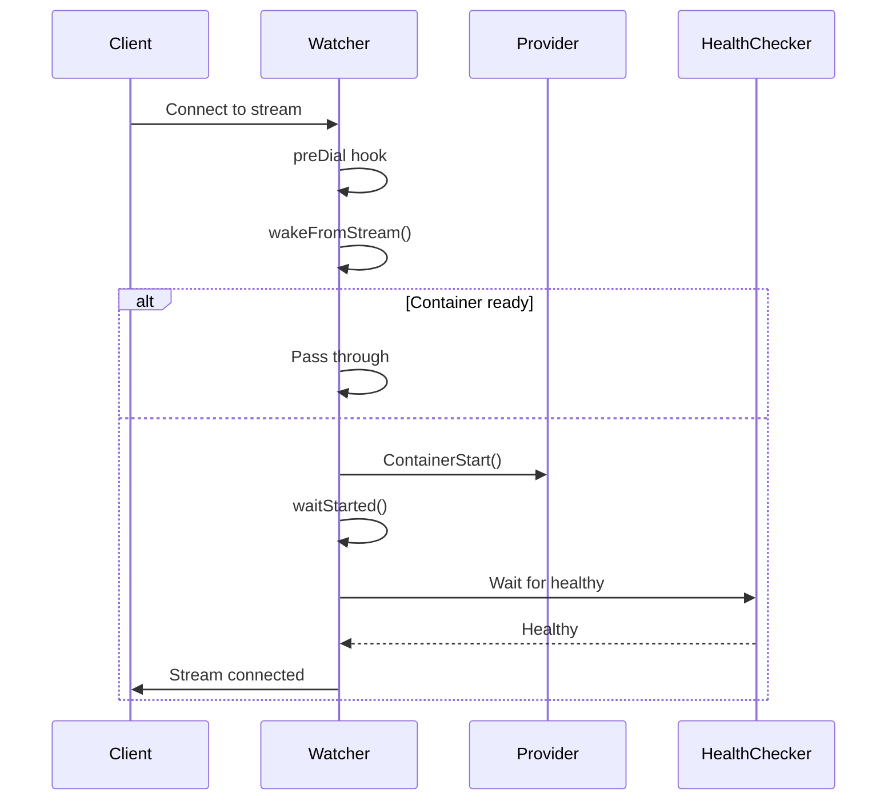
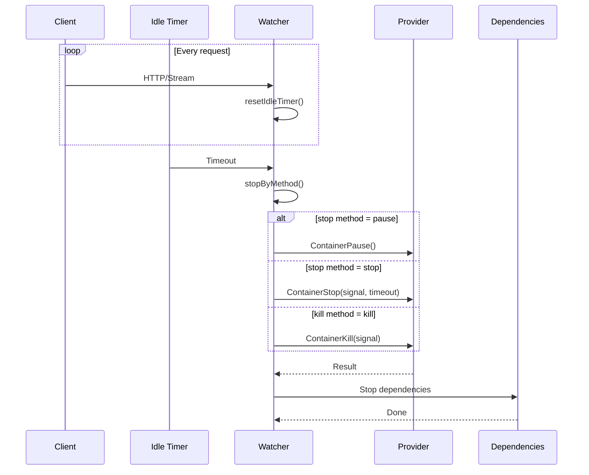
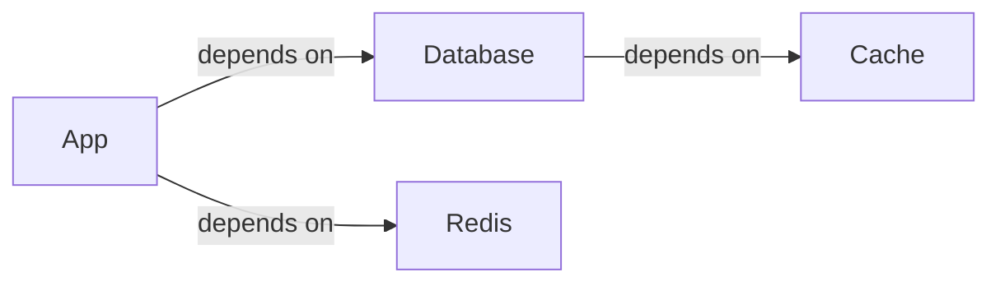
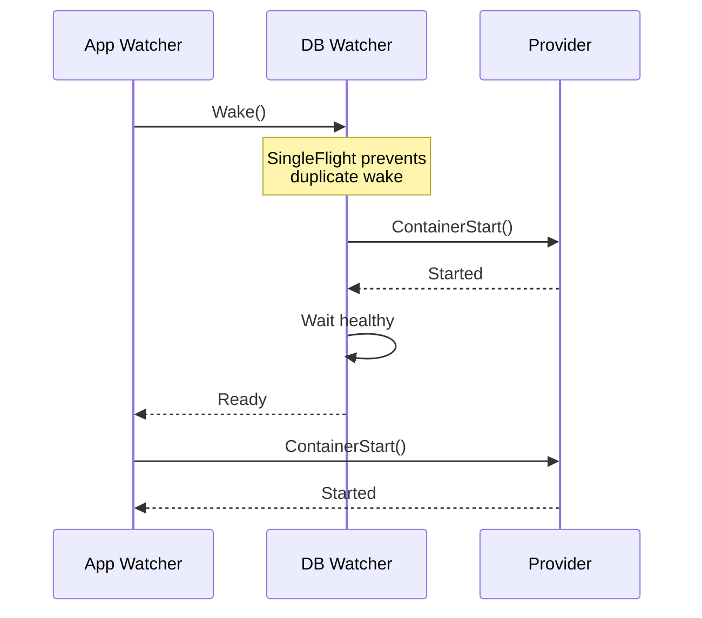
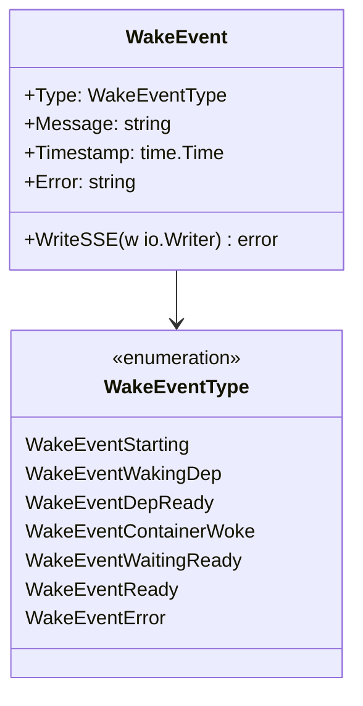

# Idlewatcher

Idlewatcher manages container lifecycle based on idle timeout. When a container is idle for a configured duration, it can be automatically stopped, paused, or killed. When a request comes in, the container is woken up automatically.

## Architecture Overview



## Directory Structure

```
idlewatcher/
├── cmd                    # Command execution utilities
├── debug.go               # Debug utilities for watcher inspection
├── errors.go              # Error types and conversion
├── events.go              # Wake event types and broadcasting
├── handle_http.go         # HTTP request handling and loading page
├── handle_http_debug.go   # Debug HTTP handler (dev only)
├── handle_stream.go       # Stream connection handling
├── health.go              # Health monitoring interface
├── loading_page.go        # Loading page HTML/CSS/JS templates
├── state.go               # Container state management
├── watcher.go             # Core Watcher implementation
├── provider/              # Container provider implementations
│   ├── docker.go          # Docker container management
│   └── proxmox.go         # Proxmox LXC management
├── types/
│   └── provider.go        # Provider interface definition
└── html/
    ├── loading_page.html  # Loading page template
    ├── style.css          # Loading page styles
    └── loading.js         # Loading page JavaScript
```

## Core Components

### Watcher

The main component that manages a single container's lifecycle:



### Provider Interface

Abstraction for different container backends:



### Container Status



## Lifecycle Flow

### Wake Flow (HTTP)



### Stream Wake Flow



### Idle Timeout Flow



## Dependency Management

Watchers can depend on other containers being started first:





## Event System

Wake events are broadcast via Server-Sent Events (SSE):



## State Machine

```mermaid
stateDiagram-v2
    note right of Napping
        Container is stopped or paused
        Idle timer stopped
    end note

    note right of Waking
        Container is starting
        Health checking active
        Events broadcasted
    end note

    note right of Ready
        Container healthy
        Idle timer running
    end note

    Napping --> Waking: Wake()
    Waking --> Ready: Health check passes
    Waking --> Error: Health check fails
    Error --> Waking: Retry
    Ready --> Napping: Idle timeout
    Ready --> Napping: Manual stop
```

## Key Files

| File                  | Purpose                                               |
| --------------------- | ----------------------------------------------------- |
| `watcher.go`          | Core Watcher implementation with lifecycle management |
| `handle_http.go`      | HTTP interception and loading page serving            |
| `handle_stream.go`    | Stream connection wake handling                       |
| `provider/docker.go`  | Docker container operations                           |
| `provider/proxmox.go` | Proxmox LXC container operations                      |
| `state.go`            | Container state transitions                           |
| `events.go`           | Event broadcasting via SSE                            |
| `health.go`           | Health monitor interface implementation               |

## Configuration

See `types.IdlewatcherConfig` for configuration options:

- `IdleTimeout`: Duration before container is put to sleep
- `StopMethod`: pause, stop, or kill
- `StopSignal`: Signal to send when stopping
- `StopTimeout`: Timeout for stop operation
- `WakeTimeout`: Timeout for wake operation
- `DependsOn`: List of dependent containers
- `StartEndpoint`: Optional endpoint restriction for wake requests
- `NoLoadingPage`: Skip loading page, wait directly

## Thread Safety

- Uses `synk.Value` for atomic state updates
- Uses `xsync.Map` for SSE subscriber management
- Uses `sync.RWMutex` for watcher map access
- Uses `singleflight.Group` to prevent duplicate wake calls
