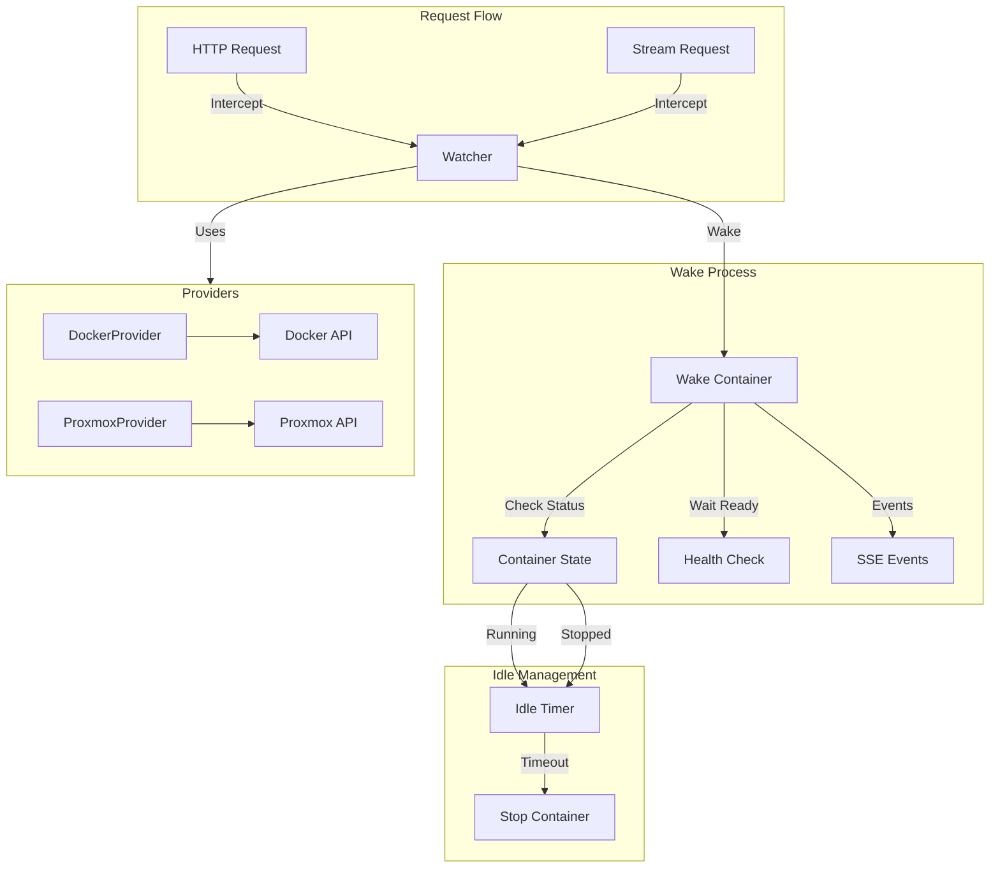
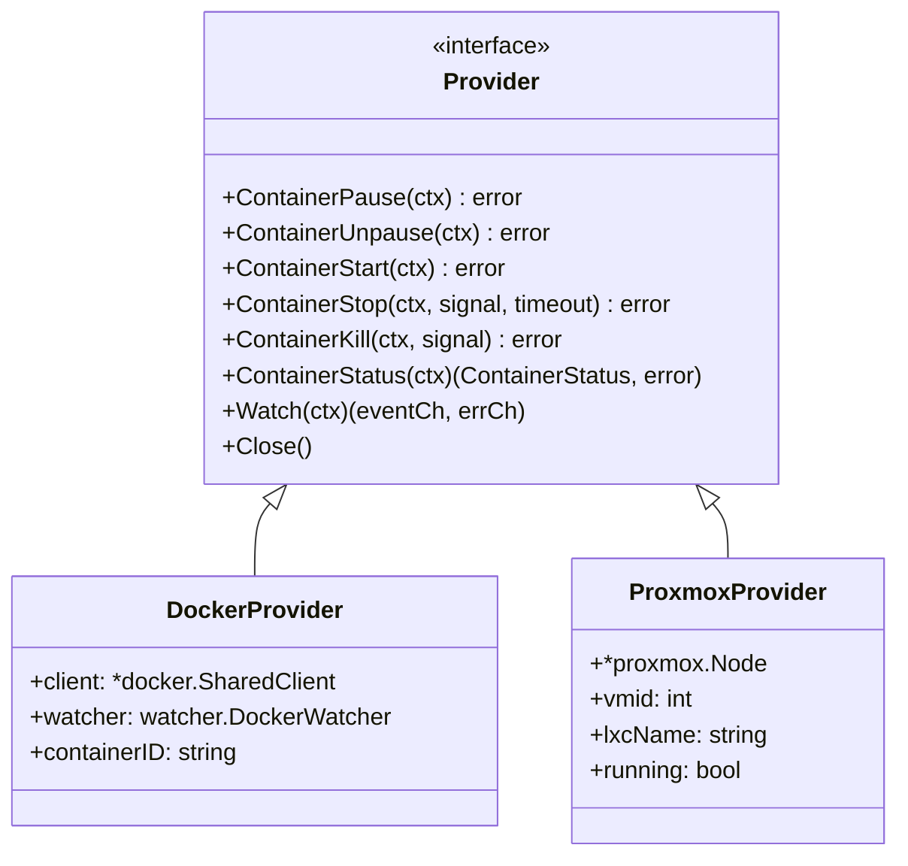
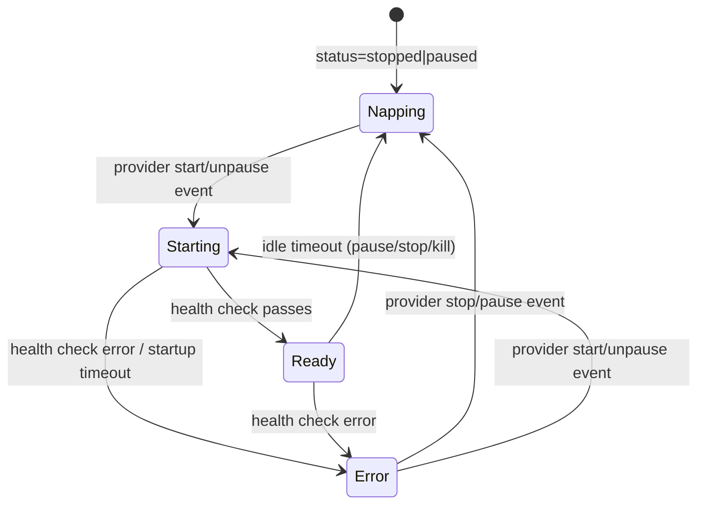
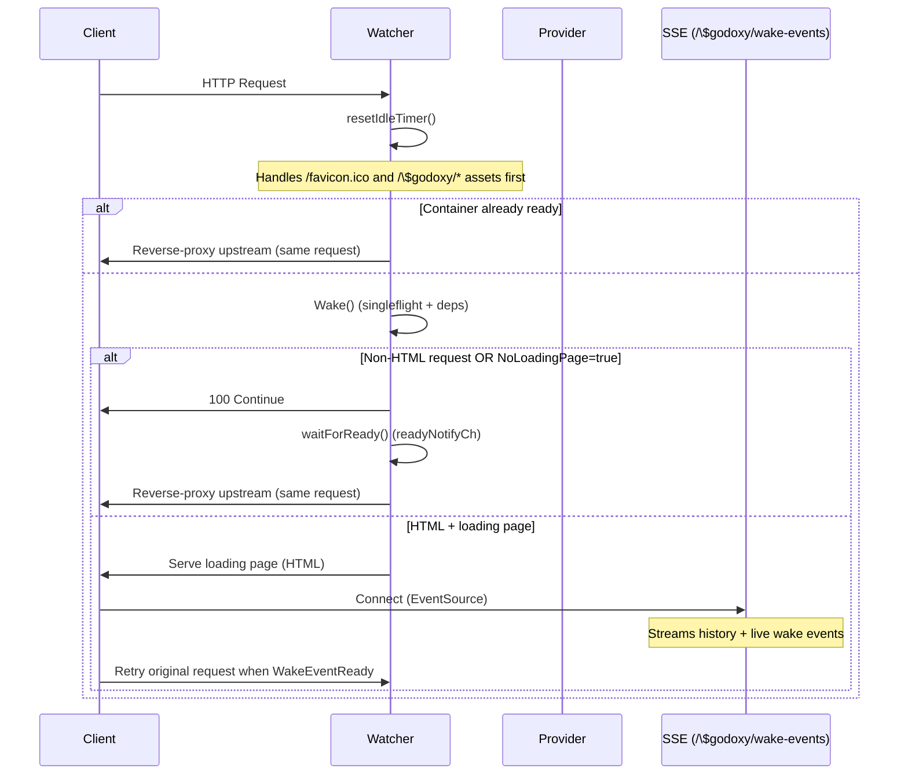
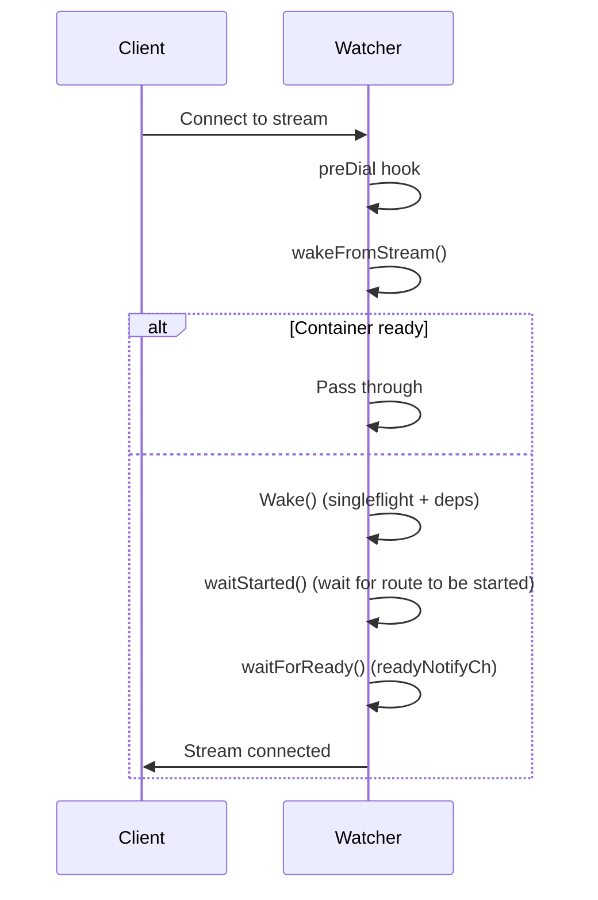
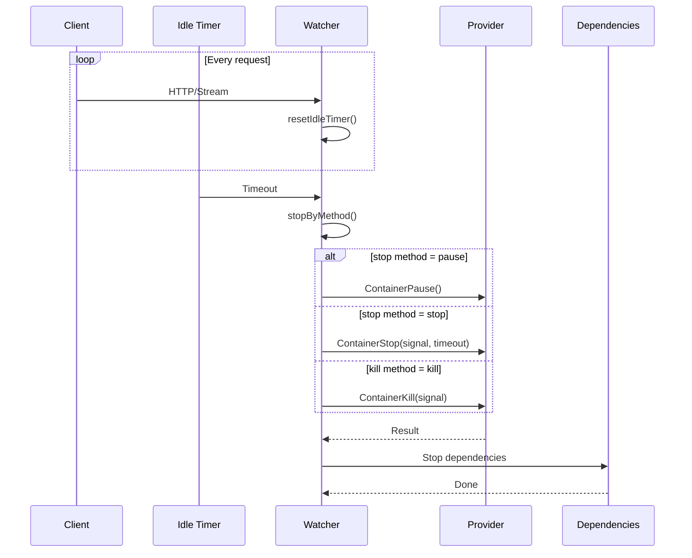
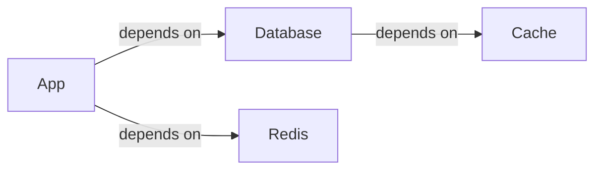
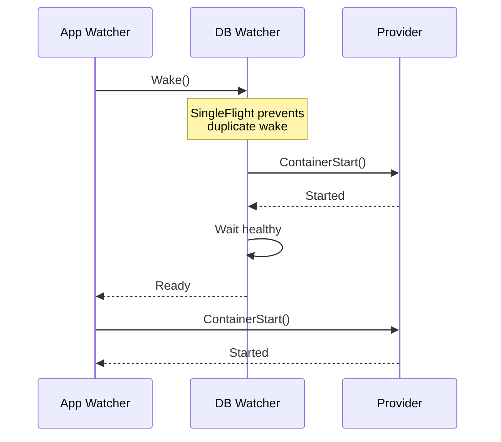
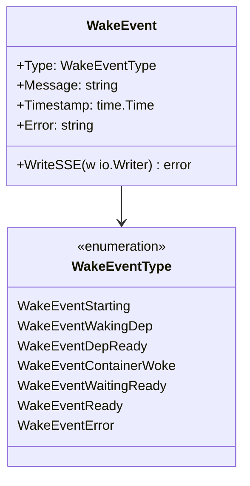
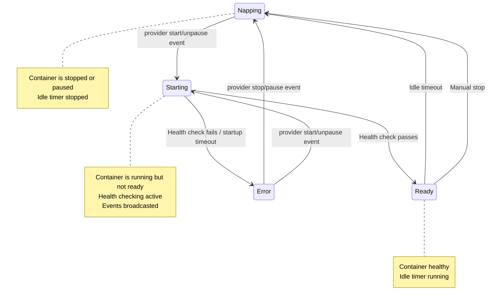

# Idlewatcher

Idlewatcher manages container lifecycle based on idle timeout. When a container is idle for a configured duration, it can be automatically stopped, paused, or killed. When a request comes in, the container is woken up automatically.

Idlewatcher also serves a small loading page (HTML + JS + CSS) and an SSE endpoint under [`internal/idlewatcher/types/paths.go`](internal/idlewatcher/types/paths.go:1) (prefixed with `/$godoxy/`) to provide wake events to browsers.

## Architecture Overview



## Directory Structure

```
idlewatcher/
├── debug.go               # Debug utilities for watcher inspection
├── errors.go              # Error types and conversion
├── events.go              # Wake event types and broadcasting
├── handle_http.go         # HTTP request handling and loading page
├── handle_http_debug.go   # Debug HTTP handler (!production builds)
├── handle_stream.go       # Stream connection handling
├── health.go              # Health monitor implementation + readiness tracking
├── loading_page.go        # Loading page HTML/CSS/JS templates
├── state.go               # Container state management
├── watcher.go             # Core Watcher implementation
├── provider/              # Container provider implementations
│   ├── docker.go          # Docker container management
│   └── proxmox.go         # Proxmox LXC management
├── types/
│   ├── container_status.go # ContainerStatus enum
│   ├── paths.go            # Loading page + SSE paths
│   ├── provider.go         # Provider interface definition
│   └── waker.go            # Waker interface (http + stream + health)
└── html/
    ├── loading_page.html  # Loading page template
    ├── style.css          # Loading page styles
    └── loading.js         # Loading page JavaScript
```

## Core Components

### Watcher

The main component that manages a single container's lifecycle:

```mermaid
classDiagram
    class Watcher {
        +string Key() string
        +Wake(ctx context.Context) error
        +Start(parent task.Parent) gperr.Error
        +ServeHTTP(rw ResponseWriter, r *Request)
        +ListenAndServe(ctx context.Context, predial, onRead HookFunc)
        -idleTicker: *time.Ticker
        -healthTicker: *time.Ticker
        -state: synk.Value~*containerState~
        -provider: synk.Value~Provider~
        -readyNotifyCh: chan struct{}
        -eventChs: *xsync.Map~chan *WakeEvent, struct{}~
        -eventHistory: []WakeEvent
        -dependsOn: []*dependency
    }

    class containerState {
        +status: ContainerStatus
        +ready: bool
        +err: error
        +startedAt: time.Time
        +healthTries: int
    }

    class dependency {
        +*Watcher
        +waitHealthy: bool
    }

    Watcher --> containerState : manages
    Watcher --> dependency : depends on
```

Package-level helpers:

- `watcherMap` is a global registry of watchers keyed by [`types.IdlewatcherConfig.Key()`](internal/types/idlewatcher.go:60), guarded by `watcherMapMu`.
- `singleFlight` is a global `singleflight.Group` keyed by container name to prevent duplicate wake calls.

### Provider Interface

Abstraction for different container backends:



### Container Status



Implementation notes:

- `Starting` is represented by `containerState{status: running, ready: false, startedAt: non-zero}`.
- `Ready` is represented by `containerState{status: running, ready: true}`.
- `Error` is represented by `containerState{status: error, err: non-nil}`.
- State is updated primarily from provider events in [`(*Watcher).watchUntilDestroy()`](internal/idlewatcher/watcher.go:553) and health checks in [`(*Watcher).checkUpdateState()`](internal/idlewatcher/health.go:104).

## Lifecycle Flow

### Wake Flow (HTTP)



### Stream Wake Flow



### Idle Timeout Flow



## Dependency Management

Watchers can depend on other containers being started first:





## Event System

Wake events are broadcast via Server-Sent Events (SSE):



Notes:

- The SSE endpoint is [`idlewatcher.WakeEventsPath`](internal/idlewatcher/types/paths.go:3).
- Each SSE subscriber gets a dedicated buffered channel; the watcher also keeps an in-memory `eventHistory` that is sent to new subscribers first.
- `eventHistory` is cleared when the container transitions to napping (stop/pause).

## State Machine



## Key Files

| File                  | Purpose                                               |
| --------------------- | ----------------------------------------------------- |
| `watcher.go`          | Core Watcher implementation with lifecycle management |
| `handle_http.go`      | HTTP interception and loading page serving            |
| `handle_stream.go`    | Stream connection wake handling                       |
| `provider/docker.go`  | Docker container operations                           |
| `provider/proxmox.go` | Proxmox LXC container operations                      |
| `state.go`            | Container state transitions                           |
| `events.go`           | Event broadcasting via SSE                            |
| `health.go`           | Health monitor implementation + readiness tracking    |

## Configuration

See [`types.IdlewatcherConfig`](internal/types/idlewatcher.go:27) for configuration options:

- `IdleTimeout`: Duration before container is put to sleep
- `StopMethod`: pause, stop, or kill
- `StopSignal`: Signal to send when stopping
- `StopTimeout`: Timeout for stop operation
- `WakeTimeout`: Timeout for wake operation
- `DependsOn`: List of dependent containers
- `StartEndpoint`: Optional HTTP path restriction for wake requests
- `NoLoadingPage`: Skip loading page, wait directly

Provider config (exactly one must be set):

- `Docker`: container id/name + docker connection info
- `Proxmox`: `node` + `vmid`

## Thread Safety

- Uses `synk.Value` for atomic state updates
- Uses `xsync.Map` for SSE subscriber management
- Uses `sync.RWMutex` for watcher map (`watcherMapMu`) and SSE event history (`eventHistoryMu`)
- Uses `singleflight.Group` to prevent duplicate wake calls
