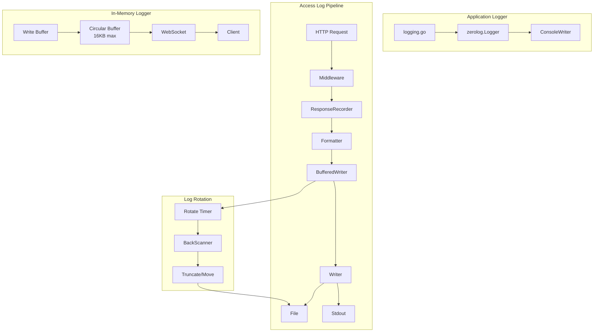
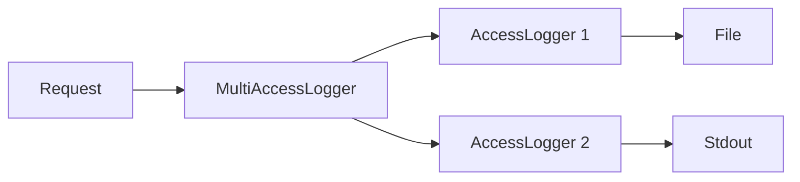
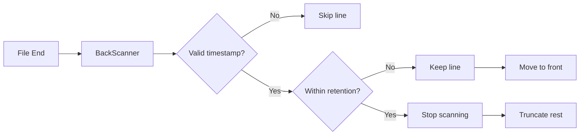
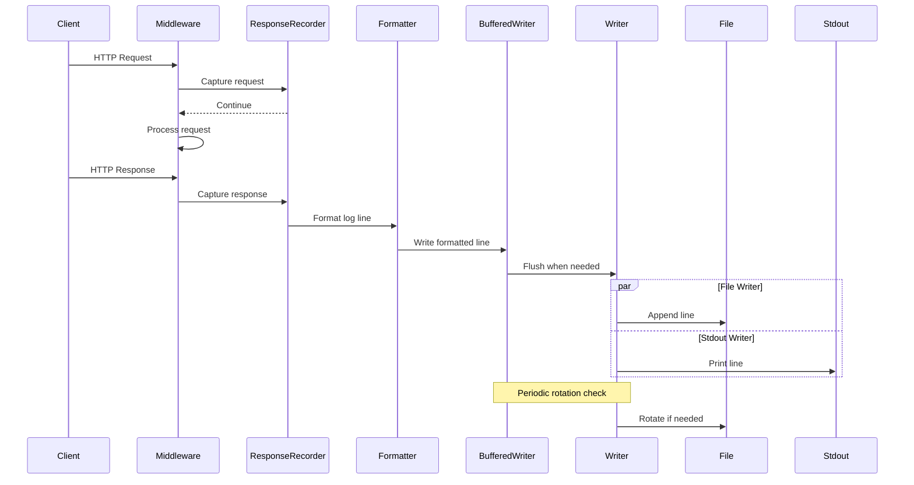

# Logging Package

This package provides structured logging capabilities for GoDoxy, including application logging, HTTP access logging, and in-memory log streaming.

## Structure

```
internal/logging/
├── logging.go          # Main logger initialization using zerolog
├── accesslog/          # HTTP access logging with rotation and filtering
│   ├── access_logger.go       # Core logging logic and buffering
│   ├── multi_access_logger.go # Fan-out to multiple writers
│   ├── config.go              # Configuration types and defaults
│   ├── formatter.go           # Log format implementations
│   ├── file_logger.go         # File I/O with reference counting
│   ├── rotate.go              # Log rotation based on retention policy
│   ├── writer.go              # Buffered/unbuffered writer abstractions
│   ├── back_scanner.go        # Backward line scanning for rotation
│   ├── filter.go              # Request filtering by status/method/header
│   ├── retention.go           # Retention policy definitions
│   ├── response_recorder.go   # HTTP response recording middleware
│   └── ...                    # Tests and utilities
└── memlogger/         # In-memory circular buffer with WebSocket streaming
    └── mem_logger.go   # Ring buffer with WebSocket event notifications
```

## Architecture Overview



## Components

### 1. Application Logger (`logging.go`)

Initializes a zerolog-based console logger with level-aware formatting:

- **Levels**: Trace → Debug → Info (determined by `common.IsTrace`/`common.IsDebug`)
- **Time Format**: 04:05 (trace) or 01-02 15:04 (debug/info)
- **Multi-line Handling**: Automatically indents continuation lines

```go
// Auto-initialized on import
func InitLogger(out ...io.Writer)

// Create logger with fixed level
NewLoggerWithFixedLevel(level zerolog.Level, out ...io.Writer)
```

### 2. Access Logging (`accesslog/`)

Logs HTTP requests/responses with configurable formats, filters, and destinations.

#### Core Interface

```go
type AccessLogger interface {
    Log(req *http.Request, res *http.Response)
    LogError(req *http.Request, err error)
    LogACL(info *maxmind.IPInfo, blocked bool)
    Config() *Config
    Flush()
    Close() error
}
```

#### Log Formats

| Format     | Description                       |
| ---------- | --------------------------------- |
| `common`   | Basic Apache Common format        |
| `combined` | Common + Referer + User-Agent     |
| `json`     | Structured JSON with full details |

#### Example Output

```
common:   localhost 127.0.0.1 - - [01-04 10:30:45] "GET /api HTTP/1.1" 200 1234
combined: localhost 127.0.0.1 - - [01-04 10:30:45] "GET /api HTTP/1.1" 200 1234 "https://example.com" "Mozilla/5.0"
json:     {"time":"04/Jan/2025:10:30:45 +0000","ip":"127.0.0.1","method":"GET",...}
```

#### Filters

Filter incoming requests before logging:

- **StatusCodes**: Keep/drop by HTTP status code range
- **Method**: Keep/drop by HTTP method
- **Headers**: Match header existence or value
- **CIDR**: Match client IP against CIDR ranges

#### Multi-Destination Support



### 3. File Management (`file_logger.go`)

- **Reference Counting**: Multiple loggers can share the same file
- **Auto-Close**: File closes when ref count reaches zero
- **Thread-Safe**: Shared mutex per file path

### 4. Log Rotation (`rotate.go`)

Rotates logs based on retention policy:

| Policy     | Description                         |
| ---------- | ----------------------------------- |
| `Days`     | Keep logs within last N days        |
| `Last`     | Keep last N log lines               |
| `KeepSize` | Keep last N bytes (simple truncate) |

**Algorithm** (for Days/Last):

1. Scan file backward line-by-line using `BackScanner`
2. Parse timestamps to find cutoff point
3. Move retained lines to file front
4. Truncate excess



### 5. Buffering (`access_logger.go`)

- **Dynamic Sizing**: Adjusts buffer size based on write throughput
- **Initial**: 4KB → **Max**: 8MB
- **Adjustment**: Every 5 seconds based on writes-per-second

### 6. In-Memory Logger (`memlogger/`)

Circular buffer for real-time log streaming via WebSocket:

- **Size**: 16KB maximum, auto-truncates old entries
- **Streaming**: WebSocket connection receives live updates
- **Events API**: Subscribe to log events

```go
// HTTP handler for WebSocket streaming
HandlerFunc() gin.HandlerFunc

// Subscribe to log events
Events() (<-chan []byte, func())

// Write to buffer (implements io.Writer)
Write(p []byte) (n int, err error)
```

## Configuration

```yaml
access_log:
  path: /var/log/godoxy/access.log # File path (optional)
  stdout: true # Also log to stdout (optional)
  format: combined # common | combined | json
  rotate_interval: 1h # How often to check rotation
  retention:
    days: 30 # Keep last 30 days
    # OR
    last: 10000 # Keep last 10000 lines
    # OR
    keep_size: 100MB # Keep last 100MB
  filters:
    status_codes: [400-599] # Only log errors
    method: [GET, POST]
    headers:
      - name: X-Internal
        value: "true"
    cidr:
      - 10.0.0.0/8
  fields:
    headers: drop # keep | drop | redacted
    query: keep # keep | drop | redacted
    cookies: drop # keep | drop | redacted
```

## Data Flow



## Key Design Patterns

1. **Interface Segregation**: Small, focused interfaces (`AccessLogger`, `Writer`, `BufferedWriter`)

2. **Dependency Injection**: Writers injected at creation for flexibility

3. **Reference Counting**: Shared file handles prevent too-many-open-files

4. **Dynamic Buffering**: Adapts to write throughput automatically

5. **Backward Scanning**: Efficient rotation without loading entire file

6. **Zero-Allocation Formatting**: Build log lines in pre-allocated buffers
