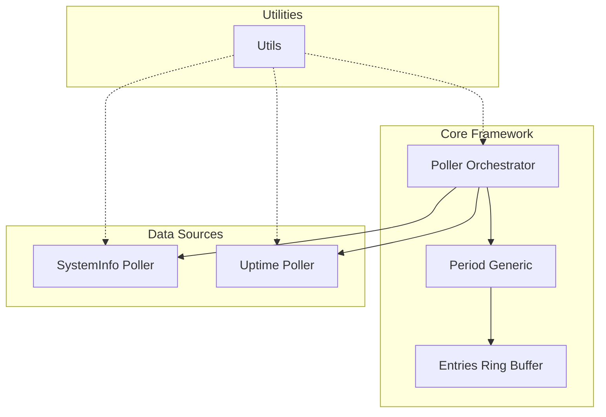
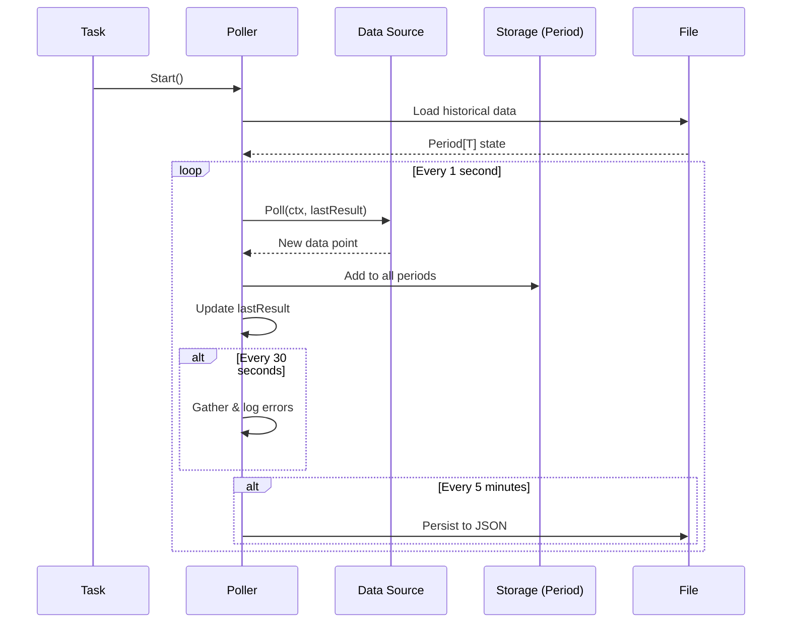
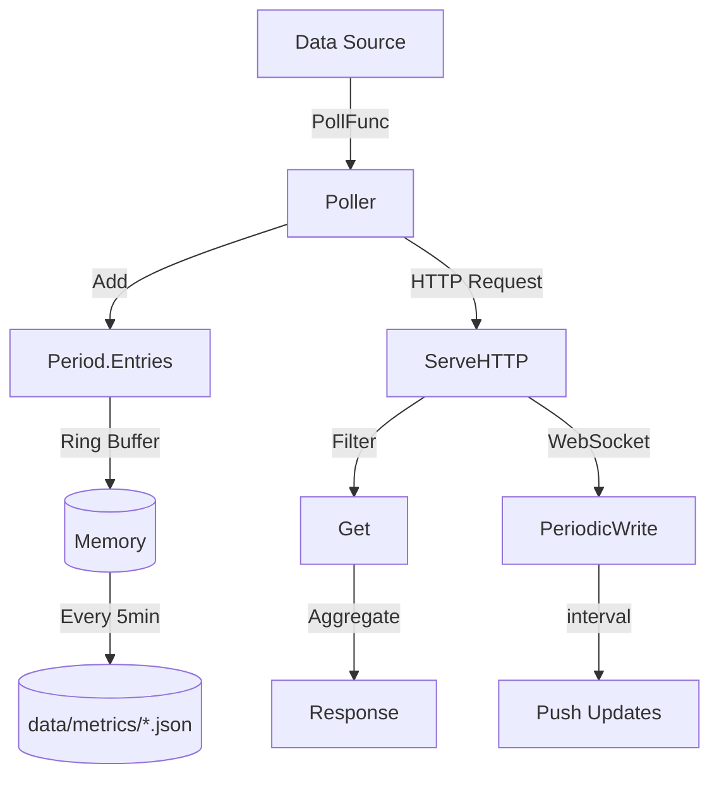

# Metrics Package

System monitoring and metrics collection for GoDoxy.

## Overview

This package provides a unified metrics collection system that polls system and route data at regular intervals, stores historical data across multiple time periods, and exposes both REST and WebSocket APIs for consumption.

## Architecture



## Directory Structure

```
internal/metrics/
├── period/           # Core polling and storage framework
│   ├── period.go     # Period[T] - multi-timeframe container
│   ├── entries.go    # Entries[T] - ring buffer implementation
│   ├── poller.go     # Poller[T, A] - orchestration and lifecycle
│   └── handler.go    # HTTP handler for data access
├── systeminfo/       # System metrics (CPU, memory, disk, network, sensors)
├── uptime/           # Route health and uptime monitoring
└── utils/            # Shared utilities (query parsing, pagination)
```

## Core Components

### 1. Period[T] (`period/period.go`)

A generic container that manages multiple time periods for the same data type.

```go
type Period[T any] struct {
    Entries map[Filter]*Entries[T]  // 5m, 15m, 1h, 1d, 1mo
    mu      sync.RWMutex
}
```

**Time Periods:**

| Filter | Duration | Entries | Interval |
| ------ | -------- | ------- | -------- |
| `5m`   | 5 min    | 100     | 3s       |
| `15m`  | 15 min   | 100     | 9s       |
| `1h`   | 1 hour   | 100     | 36s      |
| `1d`   | 1 day    | 100     | 14.4m    |
| `1mo`  | 30 days  | 100     | 7.2h     |

### 2. Entries[T] (`period/entries.go`)

A fixed-size ring buffer (100 entries) with time-aware sampling.

```go
type Entries[T any] struct {
    entries  [100]T           // Fixed-size array
    index    int              // Current position
    count    int              // Number of entries
    interval time.Duration    // Sampling interval
    lastAdd  time.Time        // Last write timestamp
}
```

**Features:**

- Circular buffer for efficient memory usage
- Rate-limited adds (respects configured interval)
- JSON serialization/deserialization with temporal spacing

### 3. Poller[T, A] (`period/poller.go`)

The orchestrator that ties together polling, storage, and HTTP serving.

```go
type Poller[T any, A any] struct {
    name         string
    poll         PollFunc[T]           // Data collection
    aggregate    AggregateFunc[T, A]   // Data aggregation
    resultFilter FilterFunc[T]         // Query filtering
    period       *Period[T]            // Data storage
    lastResult   synk.Value[T]         // Latest snapshot
}
```

**Poll Cycle (1 second interval):**



### 4. HTTP Handler (`period/handler.go`)

Provides REST and WebSocket endpoints for data access.

**Endpoints:**

- `GET /metrics?period=5m&aggregate=cpu_average` - Historical data
- `WS /metrics?period=5m&interval=5s` - Streaming updates

**Query Parameters:**
| Parameter | Type | Default | Description |
|-----------|------|---------|-------------|
| `period` | Filter | (none) | Time range (5m, 15m, 1h, 1d, 1mo) |
| `aggregate` | string | (varies) | Aggregation mode |
| `interval` | duration | 1s | WebSocket update interval |
| `limit` | int | 0 | Max results (0 = all) |
| `offset` | int | 0 | Pagination offset |
| `keyword` | string | "" | Fuzzy search filter |

## Implementations

### SystemInfo Poller

Collects system metrics using `gopsutil`:

```go
type SystemInfo struct {
    Timestamp  int64
    CPUAverage *float64
    Memory     mem.VirtualMemoryStat
    Disks      map[string]disk.UsageStat
    DisksIO    map[string]*disk.IOCountersStat
    Network    net.IOCountersStat
    Sensors    Sensors
}
```

**Aggregation Modes:**

- `cpu_average` - CPU usage percentage
- `memory_usage` - Memory used in bytes
- `memory_usage_percent` - Memory usage percentage
- `disks_read_speed` - Disk read speed (bytes/s)
- `disks_write_speed` - Disk write speed (bytes/s)
- `disks_iops` - Disk I/O operations per second
- `disk_usage` - Disk usage in bytes
- `network_speed` - Upload/download speed (bytes/s)
- `network_transfer` - Total bytes transferred
- `sensor_temperature` - Temperature sensor readings

### Uptime Poller

Monitors route health and calculates uptime statistics:

```go
type RouteAggregate struct {
    Alias         string
    DisplayName   string
    Uptime        float32  // Percentage healthy
    Downtime      float32  // Percentage unhealthy
    Idle          float32  // Percentage napping/starting
    AvgLatency    float32  // Average latency in ms
    CurrentStatus HealthStatus
    Statuses      []Status // Historical statuses
}
```

## Data Flow



## Persistence

Data is persisted to `data/metrics/` as JSON files:

```json
{
  "entries": {
    "5m": {
      "entries": [...],
      "interval": "3s"
    },
    "15m": {...},
    "1h": {...},
    "1d": {...},
    "1mo": {...}
  }
}
```

**On Load:**

- Validates and fixes interval mismatches
- Reconstructs temporal spacing for historical entries

## Thread Safety

- `Period[T]` uses `sync.RWMutex` for concurrent access
- `Entries[T]` is append-only (safe for single writer)
- `Poller` uses `synk.Value[T]` for atomic last result storage

## Creating a New Poller

```go
type MyData struct {
    Value int
}

type MyAggregate struct {
    Values []int
}

var MyPoller = period.NewPoller(
    "my_poll_name",
    func(ctx context.Context, last *MyData) (*MyData, error) {
        // Fetch data
        return &MyData{Value: 42}, nil
    },
    func(entries []*MyData, query url.Values) (int, MyAggregate) {
        // Aggregate for API response
        return len(entries), MyAggregate{Values: [...]}
    },
)

func init() {
    MyPoller.Start()
}
```

## Error Handling

- Poll errors are aggregated over 30-second windows
- Errors are logged with frequency counts
- Individual sensor warnings (e.g., ENODATA) are suppressed gracefully
