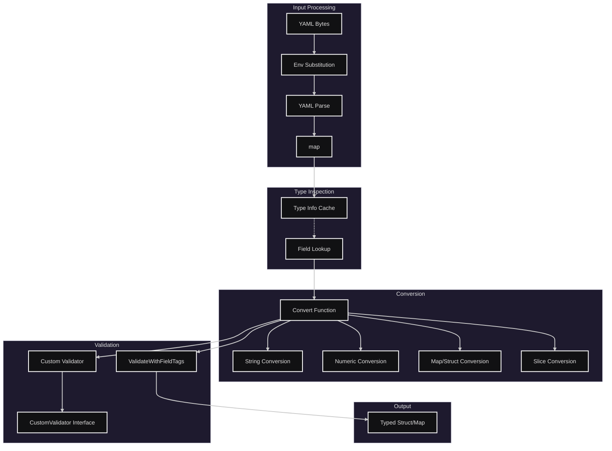
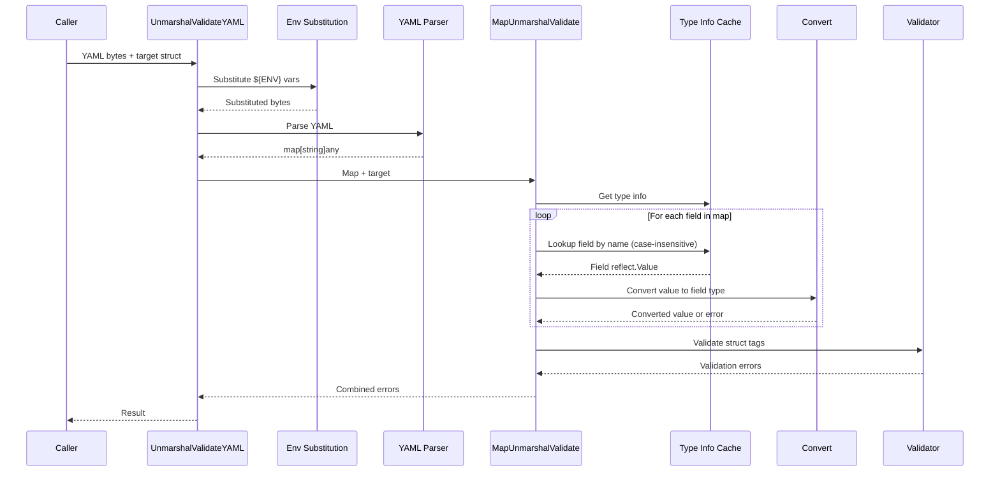

# Serialization Package

A Go package for flexible, type-safe serialization/deserialization with validation support. It provides robust handling of YAML/JSON input, environment variable substitution, and field-level validation with case-insensitive matching.

## Architecture Overview



## File Structure

| File                    | Purpose                                           |
| ----------------------- | ------------------------------------------------- |
| `serialization.go`      | Core serialization/deserialization logic          |
| `validation.go`         | Field tag validation and custom validator support |
| `time.go`               | Duration unit extensions (d, w, M)                |
| `serialization_test.go` | Core functionality tests                          |
| `validation_*_test.go`  | Validation-specific tests                         |

## Core Types

```go
type SerializedObject = map[string]any
```

The `SerializedObject` is the intermediate representation used throughout deserialization.

### Interfaces

```go
// For custom map unmarshaling logic
type MapUnmarshaller interface {
    UnmarshalMap(m map[string]any) gperr.Error
}

// For custom validation logic
type CustomValidator interface {
    Validate() gperr.Error
}
```

## Key Features

### 1. Case-Insensitive Field Matching

Fields are matched using FNV-1a hash with case-insensitive comparison:

```go
type Config struct {
    AuthToken string `json:"auth_token"`
}

// Matches: "auth_token", "AUTH_TOKEN", "AuthToken", "Auth_Token"
```

### 2. Field Tags

```go
type Config struct {
    Name    string `json:"name"`           // JSON/deserialize field name
    Port    int    `validate:"required"`   // Validation tag
    Secret  string `json:"-"`              // Exclude from deserialization
    Token   string `aliases:"key,api_key"` // Aliases for matching
}
```

| Tag           | Purpose                                      |
| ------------- | -------------------------------------------- |
| `json`        | Field name for serialization; `-` to exclude |
| `deserialize` | Explicit deserialize name; `-` to exclude    |
| `validate`    | go-playground/validator tags                 |
| `aliases`     | Comma-separated alternative field names      |

### 3. Environment Variable Substitution

Supports `${VAR}` syntax with prefix-aware lookup:

```yaml
autocert:
  auth_token: ${CLOUDFLARE_AUTH_TOKEN}
```

Prefix resolution order: `GODOXY_VAR`, `GOPROXY_VAR`, `VAR`

### 4. String Conversions

Converts strings to various types:

```go
// Duration: "1h30m", "2d" (d=day, w=week, M=month)
ConvertString("2d", reflect.ValueOf(&duration))

// Numeric: "123", "0xFF"
ConvertString("123", reflect.ValueOf(&intVal))

// Slice: "a,b,c" or YAML list format
ConvertString("a,b,c", reflect.ValueOf(&slice))

// Map/Struct: YAML format
ConvertString("key: value", reflect.ValueOf(&mapVal))
```

### 5. Custom Convertor Pattern

Types can implement a `Parse` method for custom string conversion:

```go
type Duration struct {
    Value int
    Unit  string
}

func (d *Duration) Parse(v string) error {
    // custom parsing logic
}
```

## Main Functions

### Deserialization

```go
// YAML with validation
func UnmarshalValidateYAML[T any](data []byte, target *T) gperr.Error

// YAML with interceptor
func UnmarshalValidateYAMLIntercept[T any](
    data []byte,
    target *T,
    intercept func(m map[string]any) gperr.Error,
) gperr.Error

// Direct map deserialization
func MapUnmarshalValidate(src SerializedObject, dst any) gperr.Error

// To xsync.Map
func UnmarshalValidateYAMLXSync[V any](data []byte) (*xsync.Map[string, V], gperr.Error)
```

### Conversion

```go
// Convert any value to target reflect.Value
func Convert(src reflect.Value, dst reflect.Value, checkValidateTag bool) gperr.Error

// String to target type
func ConvertString(src string, dst reflect.Value) (convertible bool, convErr gperr.Error)
```

### Validation

```go
// Validate using struct tags
func ValidateWithFieldTags(s any) gperr.Error

// Register custom validator
func MustRegisterValidation(tag string, fn validator.Func)

// Validate using CustomValidator interface
func ValidateWithCustomValidator(v reflect.Value) gperr.Error
```

### Default Values

```go
// Register factory for default values
func RegisterDefaultValueFactory[T any](factory func() *T)
```

## Usage Example

```go
package main

import (
    "os"
    "github.com/yusing/godoxy/internal/serialization"
)

type ServerConfig struct {
    Host        string `json:"host" validate:"required,hostname_port"`
    Port        int    `json:"port" validate:"required,min=1,max=65535"`
    MaxConns    int    `json:"max_conns"`
    TLSEnabled  bool   `json:"tls_enabled"`
}

func main() {
    yamlData := []byte(`
host: localhost
port: 8080
max_conns: 100
tls_enabled: true
`)

    var config ServerConfig
    if err := serialization.UnmarshalValidateYAML(yamlData, &config); err != nil {
        panic(err)
    }
    // config is now populated and validated
}
```

## Deserialization Flow



## Error Handling

Errors use `gperr` (goutils error package) with structured error subjects:

```go
// Unknown field
ErrUnknownField.Subject("field_name").With(gperr.DoYouMeanField("field_name", ["fieldName"]))

// Validation error
ErrValidationError.Subject("Namespace").Withf("required")

// Unsupported conversion
ErrUnsupportedConversion.Subjectf("string to int")
```

## Performance Optimizations

1. **Type Info Caching**: Uses `xsync.Map` to cache field metadata per type
2. **Hash-based Lookup**: FNV-1a hash for O(1) field matching
3. **Lazy Pointer Init**: Pointers initialized only when first set
4. **Presized Collections**: Initial capacity hints for maps/slices

## Testing

```bash
go test ./internal/serialization/... -v
```

Test categories:

- Basic deserialization
- Anonymous struct handling
- Pointer primitives
- String conversions
- Environment substitution
- Custom validators
